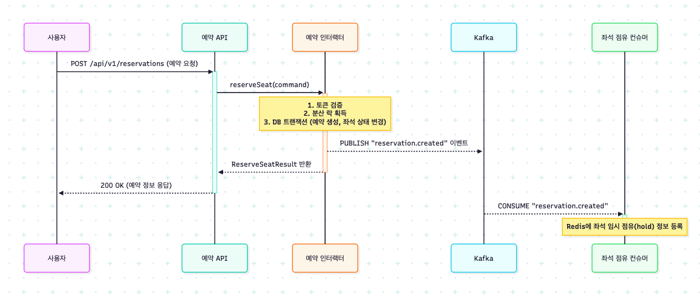

# 대규모 트래픽 처리를 위한 고성능 콘서트 예매 시스템

## 📌 프로젝트 개요

### 🎯 해결하고자 한 문제

콘서트 티켓팅처럼 **짧은 시간에 수십만 건의 요청이 몰리는 대규모 트래픽(Massive Traffic)** 상황에서 발생할 수 있는 **동시성 문제, 데이터 정합성 손상, 시스템 불안정** 등을 해결하는 것이 목표였습니다.

단순한 기능 구현을 넘어, **동시성 제어**, **정합성 보장**, **시스템 안정성**, **확장성 확보**를 통해 사용자에게 **안정적이고 공정한 예매 경험**을 제공하는 시스템을 구축했습니다.

---

### 🧩 주요 기능 요약

- **Redis 기반 대기열 시스템**으로 서버 과부하 방지
- **분산 락 + DB 트랜잭션**을 활용한 데이터 정합성 보장
- **Kafka (3-Broker Cluster)**를 통해 주요 도메인 이벤트 기반의 **비동기 처리 시스템** 구현  
  → 예: 예약 생성, 결제 성공/실패, 좌석 점유, 랭킹 업데이트, 보상 트랜잭션 등
- **응답 속도 향상 + 시스템 안정성 강화**를 동시에 달성

## 🛠️ 기술 스택

- **Backend**: Java 17, Spring Boot 3, Spring Data JPA
- **Database**: MySQL 8.0
- **In-Memory**: Redis — 대기열 처리, 분산 락, 캐싱 활용
- **Message Queue**: Apache Kafka (3-Broker Cluster 구성)
- **Testing**: JUnit 5, k6 (부하 테스트), VisualVM (성능 모니터링)
- **Infrastructure**: Docker, Docker Compose
- **Architecture**: Clean Architecture, Hexagonal Architecture

## 📁 프로젝트 구조

본 프로젝트는 **클린 아키텍처(Clean Architecture)**와 **헥사고날 아키텍처(Hexagonal Architecture)**를 기반으로 설계되었습니다.  
각 도메인(`concert`, `queue`, `reservation`, `payment`, `user`)을 **독립적인 모듈**로 구성하여, 핵심 비즈니스 로직을 프레임워크나 외부 기술로부터 **완전히 분리**했습니다.

이러한 구조는 테스트 용이성을 높이고, 추후 **MSA(Microservice Architecture)**로의 전환에 유리한 기반을 마련합니다.

```bash
└── src/main/java/kr/hhplus/be/server/
    ├── common      # 공통 모듈 (AOP, Config, Exception, Event 등)
    ├── concert     # 콘서트, 좌석, 랭킹 도메인
    ├── external    # 외부 시스템 연동 모듈 (DataPlatform)
    ├── payment     # 결제 도메인
    ├── queue       # 대기열 도메인
    ├── reservation # 예약 도메인
    └── user        # 사용자 및 포인트 도메인
```

각 도메인 모듈은 **헥사고날 아키텍처(Hexagonal Architecture)**를 기반으로 다음과 같은 표준 구조를 따릅니다:
* domain:
시스템의 핵심 비즈니스 규칙과 엔티티가 위치하는 순수한 영역입니다.
* port:
내부(usecase)와 외부(adapter)를 연결하는 인터페이스 계층입니다.
  * in: 외부 요청을 수신하기 위한 Inbound Port
  * out: 외부 시스템과 통신하기 위한 Outbound Port
* usecase:
사용자의 요청을 받아 도메인을 조합하고 조율하는 비즈니스 흐름 처리 영역입니다.
* adapter:
외부 세계(Web, DB, 메시지 브로커 등)와 상호작용하는 구현체 영역입니다.
  * in: Inbound Port의 구현체 (예: Web Controller, Kafka Consumer)
  * out: Outbound Port의 구현체 (예: JPA Repository, Kafka Producer)
    💡 더 자세한 아키텍처 설계 및 부하 테스트 결과는 아래 문서에서 확인하실 수 있습니다.
    ➡️ [전체 문서 보러가기](./docs)

## 📊 테스트 및 부하 테스트 결과

시스템의 성능과 안정성을 객관적으로 검증하기 위해, **k6**를 사용해 실제 운영 환경과 유사한 **복합 시나리오 기반 부하 테스트**를 점진적으로 수행하였고, **VisualVM**으로 런타임 부하를 모니터링했습니다.

- **1차 테스트**  
  Stateful 컨트롤러에서 발생한 동시성 문제를 발견하여 **Stateless 구조로 전환**한 결과,  
  총 처리량 **87.5% 증가**, API 응답 속도 **24.2% 단축**이라는 뚜렷한 성능 개선을 확인했습니다.

- **최종 스트레스 테스트**  
  최대 **200명의 동시 사용자**가 약 **8분간** 예매, 조회, 결제 실패 등의 시나리오를 복합 수행한 테스트에서,  
  **서버 오류율 0%**, 95%의 요청을 **50ms 이내에 처리**하는 높은 안정성을 확인했습니다.

> 💡 상세한 테스트 시나리오와 단계별 성능 분석은 아래 보고서에서 확인하실 수 있습니다:  
> ➡️ [Stateless 전환 부하 테스트 보고서](./docs/load_test_report/k6/Stateless_전환_부하테스트_보고서.md)  
> ➡️ [200명 다중 시나리오 부하 테스트 보고서](./docs/load_test_report/k6/200v_다중시나리오_고급_부하테스트_보고서.md)

---

## 🧩 아키텍처 / 인프라 구성

로컬 환경에서도 실제 운영과 유사한 분산 시스템 구성을 목표로, **Docker Compose**를 활용하여 다음과 같은 인프라 환경을 구성했습니다:

- API 서버
- MySQL 데이터베이스
- Redis
- 3개의 브로커로 구성된 Kafka 클러스터

이 구조는 **이벤트 기반 아키텍처** 구현과 확장성 검증에 유리한 환경을 제공합니다.

> 💡 Kafka 기반 이벤트 처리 설계 및 인프라 구성도는 아래 문서를 참고하세요:  
> ➡️ [MSA 설계 문서](./docs/MSA/MSA설계.md)  
> ➡️ [인프라 구성도](./docs/infra/인프라_구성도.md)  
> ➡️ [예약 생성 후처리 아키텍처](./docs/kafka/예약생성_후처리_Kafka_기반_이벤트_아키텍처_설계.md)  
> ➡️ [결제 성공 후처리 아키텍처](./docs/kafka/결제성공_후처리_Kafka_기반_이벤트_아키텍처_설계.md)  
> ➡️ [결제 실패 후처리 아키텍처](./docs/kafka/결제실패_후처리_Kafka_기반_이벤트_아키텍처_설계.md)

---

## 🔁 시퀀스 다이어그램

- **예약 생성 후처리 시퀀스**  
  

- **결제 성공 후처리 시퀀스**  
  

- **결제 실패 후처리 시퀀스**  
  

- **큐 토큰 발급 로직 프로세스**  
  

- **Kafka 이벤트 아키텍처 설계 프로세스**  
  


## 🎯 기술적 도전 / 트러블슈팅

### 1. 대규모 동시 요청 제어 — 분산 락 + 대기열

- **문제**  
  수만 명의 사용자가 동시에 특정 좌석을 예약할 때, **Dirty Read**, **중복 예약**, **데이터 부정합** 문제가 발생했습니다.

- **해결**
  - Redis + Redisson을 이용하여 `seatId` 단위의 **분산 락**을 적용해 동시 접근을 원천 차단했습니다.
  - 그 이전 단계에서는 **Redis Sorted Set + Lua Script** 기반의 **대기열 시스템**을 도입하여, 서버가 처리 가능한 요청만 선별적으로 수용하게 했습니다.

---

### 2. Stateful 컨트롤러의 동시성 문제 해결

- **문제**  
  초기 부하 테스트에서, `@RequestScope`와 멤버 변수를 사용하는 **Stateful 컨트롤러 구조**가 **Race Condition**을 유발하여  
  사용자 간 응답 데이터가 뒤섞이는 심각한 문제가 발생했습니다.

- **해결**  
  모든 컨트롤러를 **Stateless 구조로 리팩토링**하였습니다.
  - 서비스 계층이 처리 결과를 직접 반환하고
  - 컨트롤러는 이를 단순히 응답으로 전달하도록 변경함으로써
  - 동시성 문제를 근본적으로 제거하고, **처리량을 87.5% 향상**시켰습니다.

---

### 3. Kafka 기반 비동기 이벤트 아키텍처 설계

- **문제**  
  예약 및 결제 이후 발생하는 **후처리 작업**(랭킹 업데이트, Redis 정리 등)을 동기 처리할 경우,  
  API 응답 지연 및 시스템 간 **강결합** 문제가 발생했습니다.

- **해결**  
  Kafka 기반의 **이벤트 기반 아키텍처**를 도입하고, **코레오그래피 사가 패턴**을 적용하여 트랜잭션과 후처리를 완전히 분리했습니다.

  - 예약 서비스는 `reservation.created` 이벤트를 발행하고,  
    → Redis에 좌석 점유 정보를 등록
  - 결제 서비스는 `payment.success` / `payment.failed` 이벤트를 발행하며,  
    → **payment.success**: 랭킹 업데이트, 외부 데이터 플랫폼 전송  
    → **payment.failed**: DB 보상 트랜잭션 실행
  - 공통 후처리: Redis의 임시 데이터 정리

  이를 통해 서비스 간 결합도를 줄이고, **유연하고 확장 가능한 구조**를 확보했습니다.

# Docker 컨테이너 실행 (MySQL, Redis, Kafka Cluster)
docker-compose up -d

# Spring Boot 애플리케이션 실행
./gradlew bootRun


## 🔄 회고
배운 점 및 느낀 점
이번 프로젝트를 통해 단순한 기능 구현을 넘어, 대규모 트래픽 환경에서 동시성 제어, 데이터 정합성, 시스템 안정성을 깊이 있게 고민하며 설계하는 경험을 할 수 있었습니다.
특히, k6 부하 테스트를 통해 성능 병목 지점을 가설 → 검증 → 개선 → 재검증하는 과정을 체계적으로 경험한 것이 가장 큰 수확이었습니다.
Stateless 컨트롤러의 중요성, Kafka 기반의 비동기 아키텍처가 실제 문제를 어떻게 해결하는지를 체감하며, 이론으로만 알고 있던 개념들을 현실에 적용해볼 수 있었습니다.

## 🔧 개선 방향
* Dead Letter Queue(DLQ) 도입
현재는 Kafka 이벤트 처리 중 모든 재시도에 실패한 경우, 에러 로그로만 남기고 있습니다.
향후에는 실패한 메시지를 DLQ 토픽에 전송하고 수동 복구 파이프라인을 구축함으로써, 데이터 유실을 방지하고 시스템 신뢰성을 더욱 강화할 계획입니다.
* 스테이징 환경 테스트
로컬 환경의 한계를 넘기 위해, 실제 운영 환경과 유사한 스테이징 환경에서 고강도 부하 테스트(Spike Test, Soak Test 등)를 추가로 수행할 예정입니다.
이를 통해 시스템의 임계점을 보다 정밀하게 파악하고, 보다 실전적인 성능 튜닝을 진행할 수 있습니다.


## ✨ 마무리 팁
이 프로젝트는 대규모 트래픽 문제 해결 과정의 기술적 고민과 성장 스토리를 담고 있습니다.
각 커밋 메시지와 PR 내용을 함께 살펴보시면, 어떤 문제를 어떻게 접근하고 해결해 나갔는지 전체적인 흐름을 이해하실 수 있습니다.
* [#2](https://github.com/JHYUNJIN/hhplus-concert/pull/2): 서버 구축 (클린 아키텍처 기반 프로젝트 구조 세팅)
* [#3](https://github.com/JHYUNJIN/hhplus-concert/pull/3): 동시성 문제 해결 및 각 도메인의 유닛/통합 테스트 적용
* [#4](https://github.com/JHYUNJIN/hhplus-concert/pull/4): 대용량 트래픽 및 데이터 처리 (분산락, 보상 트랜잭션 적용)
* [#6](https://github.com/JHYUNJIN/hhplus-concert/pull/6): 모듈형 모놀리스 아키텍처 전환 및 Kafka 기반 이벤트 구조 설계 (헥사고날 아키텍처 도입 포함)
* [#7](https://github.com/JHYUNJIN/hhplus-concert/pull/7): 시스템 아키텍처 개선 및 k6 부하 테스트 적용 (Kafka ACL 적용, DIP 구조 개선 등)
