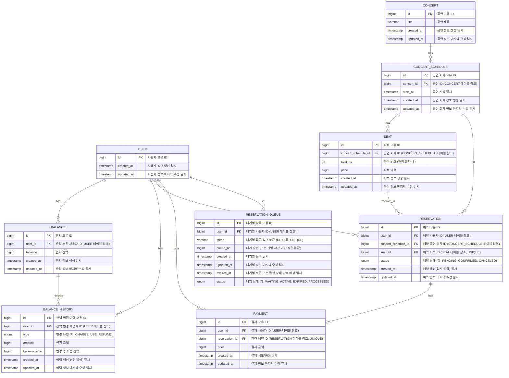

```mermaid
erDiagram
    USER ||--o{ BALANCE : has
    USER ||--o{ BALANCE_HISTORY : has
    USER ||--o{ RESERVATION : makes
    USER ||--o{ PAYMENT : pays
    USER ||--o{ RESERVATION_QUEUE : in

    CONCERT ||--o{ CONCERT_SCHEDULE : has
    CONCERT_SCHEDULE ||--o{ SEAT : has
    CONCERT_SCHEDULE ||--o{ RESERVATION : for
    SEAT ||--o{ RESERVATION : reserved_in
    RESERVATION ||--o{ PAYMENT : has

    BALANCE ||--o{ BALANCE_HISTORY : records

    USER {
        bigint id PK "사용자 고유 ID"
        timestamp created_at "사용자 정보 생성 일시"
        timestamp updated_at "사용자 정보 마지막 수정 일시"
        %% 추가 가능 컬럼: email, password, name 등
    }
    BALANCE {
        bigint id PK "잔액 고유 ID"
        bigint user_id FK "잔액 소유 사용자 ID (USER 테이블 참조)"
        bigint balance "현재 잔액"
        timestamp created_at "잔액 정보 생성 일시"
        timestamp updated_at "잔액 정보 마지막 수정 일시"
        %% 추가 가능 컬럼: version (옵티미스틱 락)
    }
    BALANCE_HISTORY {
        bigint id PK "잔액 변경 이력 고유 ID"
        bigint user_id FK "잔액 변경 사용자 ID (USER 테이블 참조)"
        enum type "변경 유형 (예: CHARGE, USE, REFUND)"
        bigint amount "변경 금액"
        bigint balance_after "변경 후 최종 잔액"
        timestamp created_at "이력 생성(변경 발생) 일시"
        timestamp updated_at "이력 정보 마지막 수정 일시"
        %% 추가 가능 컬럼: balance_id (BALANCE 테이블 참조), reason, payment_id
    }
    RESERVATION_QUEUE {
        bigint id PK "대기열 항목 고유 ID"
        bigint user_id FK "대기열 사용자 ID (USER 테이블 참조)"
        varchar token "대기열 접근/식별 토큰 (UUID 등, UNIQUE)"
        bigint queue_no "대기 순번 (또는 진입 시간 기반 정렬용 값)"
        timestamp created_at "대기열 등록 일시"
        timestamp updated_at "대기열 정보 마지막 수정 일시"
        timestamp expires_at "대기열 토큰 또는 활성 상태 만료 예정 일시"
        enum status "대기 상태 (예: WAITING, ACTIVE, EXPIRED, PROCESSED)"
        %% 추가 가능 컬럼: concert_schedule_id (어떤 공연 회차의 대기열인지)
    }
    CONCERT {
        bigint id PK "공연 고유 ID"
        varchar title "공연 제목"
        timestamp created_at "공연 정보 생성 일시"
        timestamp updated_at "공연 정보 마지막 수정 일시"
        %% 추가 가능 컬럼: description, artist, poster_image_url 등
    }
    CONCERT_SCHEDULE {
        bigint id PK "공연 회차 고유 ID"
        bigint concert_id FK "공연 ID (CONCERT 테이블 참조)"
        timestamp start_at "공연 시작 일시"
        timestamp created_at "공연 회차 정보 생성 일시"
        timestamp updated_at "공연 회차 정보 마지막 수정 일시"
        %% 추가 가능 컬럼: available_seats_count, version (옵티미스틱 락)
    }
    SEAT {
        bigint id PK "좌석 고유 ID"
        bigint concert_schedule_id FK "공연 회차 ID (CONCERT_SCHEDULE 테이블 참조)"
        int seat_no "좌석 번호 (해당 회차 내)"
        bigint price "좌석 가격"
        timestamp created_at "좌석 정보 생성 일시"
        timestamp updated_at "좌석 정보 마지막 수정 일시"
        %% 추가 가능 컬럼: section, row_name, col_number, is_reserved_db (DB 최종 예약 상태), version
        %% UNIQUE 제약 조건: (concert_schedule_id, seat_no)
    }
    RESERVATION {
        bigint id PK "예약 고유 ID"
        bigint user_id FK "예약 사용자 ID (USER 테이블 참조)"
        bigint concert_schedule_id FK "예약 공연 회차 ID (CONCERT_SCHEDULE 테이블 참조)"
        bigint seat_id FK "예약 좌석 ID (SEAT 테이블 참조, UNIQUE)"
        enum status "예약 상태 (예: PENDING, CONFIRMED, CANCELED)"
        timestamp created_at "예약 생성(임시 예약) 일시"
        timestamp updated_at "예약 정보 마지막 수정 일시"
        %% 추가 가능 컬럼: total_amount, confirmed_at, version (옵티미스틱 락)
    }
    PAYMENT {
        bigint id PK "결제 고유 ID"
        bigint user_id FK "결제 사용자 ID (USER 테이블 참조)"
        bigint reservation_id FK "관련 예약 ID (RESERVATION 테이블 참조, UNIQUE)"
        bigint price "결제 금액"
        timestamp created_at "결제 시도/생성 일시"
        timestamp updated_at "결제 정보 마지막 수정 일시"
        %% 추가 가능 컬럼: method (결제 수단), status (결제 상태), paid_at, version
    }
```