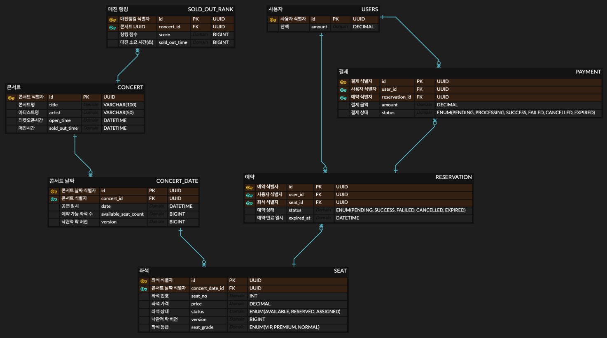

# 🎟 콘서트 예약 시스템 ERD 설계 문서
## 🔍 설계 의도 요약
* 좌석 예약 성능과 데이터 정합성 사이에서 트레이드오프 존재
* 성능 이슈가 우려되는 부분은 Redis 기반 캐시 + TTL 전략으로 해소
* 반대로, 예약/결제 등 정합성이 중요한 영역은 인덱스를 유지하고 DB로 처리
* 불필요한 인덱스는 과감히 제거 → 쓰기 성능과 스토리지 비용 절감

## 💡 주요 설계 결정
### ✅ Redis 캐시 도입
* 좌석 상태는 자주 바뀌는 값이므로 캐싱 고민이 있었으나,
    * 프론트단 제어와 함께 짧은 TTL을 이용해 Redis 캐시로 대응하기로 결정
* 좌석 상태의 정합성은 예약 확정 단계에서 DB 확인으로 보완
  
### ✅ 인덱스 전략
* 조회 빈도는 높지만 실시간 정합성이 약간 허용 가능한 영역은 Redis로 대체
* 인덱스는 다음 2개만 유지:
    1. 예약 가능한 콘서트 조회 최적화 → open_time, sold_out_time
    2. 만료 예약 정리 배치 최적화 → status, expires_at


# ERD 구조



# 테이블 생성 쿼리

## 유저 테이블

```sql
CREATE TABLE USERS (
    id VARCHAR(36) NOT NULL COMMENT '사용자 UUID',
    amount DECIMAL(10, 0) NOT NULL DEFAULT 0 COMMENT '사용자 잔액',
    created_at TIMESTAMP NOT NULL DEFAULT CURRENT_TIMESTAMP COMMENT '생성일시',
    updated_at TIMESTAMP NOT NULL DEFAULT CURRENT_TIMESTAMP ON UPDATE CURRENT_TIMESTAMP COMMENT '수정일시',
    PRIMARY KEY (id)
) COMMENT '사용자 정보 테이블';
```

## 콘서트 테이블

```sql
CREATE TABLE CONCERT (
    id VARCHAR(36) NOT NULL COMMENT '콘서트 UUID',
    title VARCHAR(100) NOT NULL COMMENT '콘서트 제목',
    artist VARCHAR(50) NOT NULL COMMENT '아티스트명',
    open_time DATETIME NOT NULL COMMENT '티켓 오픈 시간',
    sold_out_time DATETIME NULL COMMENT '매진 완료 시간',
    created_at TIMESTAMP NOT NULL DEFAULT CURRENT_TIMESTAMP COMMENT '생성일시',
    updated_at TIMESTAMP NOT NULL DEFAULT CURRENT_TIMESTAMP ON UPDATE CURRENT_TIMESTAMP COMMENT '수정일시',
    PRIMARY KEY (id)
) COMMENT '콘서트 정보 테이블';

-- 예약 가능한 콘서트 조회 성능 최적화를 위한 복합 인덱스
CREATE INDEX idx_concert_open_soldout ON CONCERT (open_time, sold_out_time);
```

## 콘서트 날짜 테이블

```sql
CREATE TABLE CONCERT_DATE (
    id VARCHAR(36) NOT NULL COMMENT '콘서트 날짜 UUID',
    concert_id VARCHAR(36) NOT NULL COMMENT '콘서트 UUID',
    date DATETIME NOT NULL COMMENT '공연 일시',
    deadline DATETIME NOT NULL COMMENT '예약 마감 일시',
    available_seat_count BIGINT COMMENT '예약 가능 좌석 수 (비정규화)',
    version BIGINT COMMENT '낙관적 락을 위한 버전',
    created_at TIMESTAMP NOT NULL DEFAULT CURRENT_TIMESTAMP COMMENT '생성일시',
    updated_at TIMESTAMP NOT NULL DEFAULT CURRENT_TIMESTAMP ON UPDATE CURRENT_TIMESTAMP COMMENT '수정일시',
    PRIMARY KEY (id),
    FOREIGN KEY (concert_id) REFERENCES CONCERT(id) ON DELETE CASCADE
) COMMENT '콘서트 날짜 정보 테이블';
```

## 좌석 테이블

> - 좌석 임시 배정 Redis 사용 구현
> - 좌석 번호에 따른 등급 및 가격 차등 적용
> - 1~10 VIP
> - 11~30 프리미엄
> - 31~50 일반

```sql
CREATE TABLE SEAT (
    id VARCHAR(36) NOT NULL COMMENT '좌석 UUID',
    concert_date_id VARCHAR(36) NOT NULL COMMENT '콘서트 날짜 UUID',
    seat_no INT NOT NULL COMMENT '좌석 번호',
    price DECIMAL(8, 0) NOT NULL COMMENT '좌석 가격',
    seat_class VARCHAR(255) NOT NULL COMMENT '좌석 등급',
    status VARCHAR(10) NOT NULL DEFAULT 'AVAILABLE' COMMENT '좌석 상태 (AVAILABLE, RESERVED, ASSIGNED)',
    version BIGINT COMMENT '낙관적 락을 위한 버전',
    created_at TIMESTAMP NOT NULL DEFAULT CURRENT_TIMESTAMP COMMENT '생성일시',
    updated_at TIMESTAMP NOT NULL DEFAULT CURRENT_TIMESTAMP ON UPDATE CURRENT_TIMESTAMP COMMENT '수정일시',
    PRIMARY KEY (id),
    FOREIGN KEY (concert_date_id) REFERENCES CONCERT_DATE(id) ON DELETE CASCADE
) COMMENT '좌석 정보 테이블';
```

## 결제 테이블

```sql
CREATE TABLE PAYMENT (
    id VARCHAR(36) NOT NULL COMMENT '결제 UUID',
    user_id VARCHAR(36) NOT NULL COMMENT '사용자 UUID',
    reservation_id VARCHAR(36) NOT NULL COMMENT '예약 UUID',
    amount DECIMAL(10, 0) NOT NULL COMMENT '결제 금액',
    status VARCHAR(10) NOT NULL DEFAULT 'PENDING' COMMENT '결제 상태 (PENDING, SUCCESS, FAILED)',
    failure_reason VARCHAR(255) NULL COMMENT '실패 사유',
    created_at TIMESTAMP NOT NULL DEFAULT CURRENT_TIMESTAMP COMMENT '생성일시',
    updated_at TIMESTAMP NOT NULL DEFAULT CURRENT_TIMESTAMP ON UPDATE CURRENT_TIMESTAMP COMMENT '수정일시',
    PRIMARY KEY (id),
    FOREIGN KEY (user_id) REFERENCES USERS(id),
    FOREIGN KEY (reservation_id) REFERENCES RESERVATION(id)
) COMMENT '결제 정보 테이블';
```

## 예약 테이블

```sql
CREATE TABLE RESERVATION (
    id VARCHAR(36) NOT NULL COMMENT '예약 UUID',
    user_id VARCHAR(36) NOT NULL COMMENT '사용자 UUID',
    seat_id VARCHAR(36) NOT NULL COMMENT '좌석 UUID',
    status VARCHAR(10) NOT NULL DEFAULT 'PENDING' COMMENT '예약 상태 (PENDING, SUCCESS, FAILED, EXPIRED)',
    expires_at DATETIME NOT NULL COMMENT '예약 만료 시간',
    created_at TIMESTAMP NOT NULL DEFAULT CURRENT_TIMESTAMP COMMENT '생성일시',
    updated_at TIMESTAMP NOT NULL DEFAULT CURRENT_TIMESTAMP ON UPDATE CURRENT_TIMESTAMP COMMENT '수정일시',
    PRIMARY KEY (id),
    FOREIGN KEY (user_id) REFERENCES USERS(id),
    FOREIGN KEY (seat_id) REFERENCES SEAT(id)
) COMMENT '예약 정보 테이블';

-- 배치 스케줄러의 만료된 예약 조회 성능 최적화를 위한 복합 인덱스
CREATE INDEX idx_reservation_status_expires ON RESERVATION (status, expires_at);
```

## 매진 랭킹 테이블

```sql
CREATE TABLE SOLD_OUT_RANK (
    id VARCHAR(36) NOT NULL COMMENT '매진 랭킹 UUID',
    concert_id VARCHAR(36) NOT NULL COMMENT '콘서트 UUID',
    score BIGINT NOT NULL COMMENT '랭킹 점수',
    sold_out_time BIGINT NOT NULL COMMENT '매진 소요 시간(초)',
    created_at TIMESTAMP NOT NULL DEFAULT CURRENT_TIMESTAMP COMMENT '생성일시',
    updated_at TIMESTAMP NOT NULL DEFAULT CURRENT_TIMESTAMP ON UPDATE CURRENT_TIMESTAMP COMMENT '수정일시',
    PRIMARY KEY (id),
    UNIQUE KEY uk_soldout_concert_id (concert_id), -- 콘서트별 랭킹은 하나만 존재
    FOREIGN KEY (concert_id) REFERENCES CONCERT(id) ON DELETE CASCADE
) COMMENT '콘서트 매진 랭킹 정보 테이블';
```