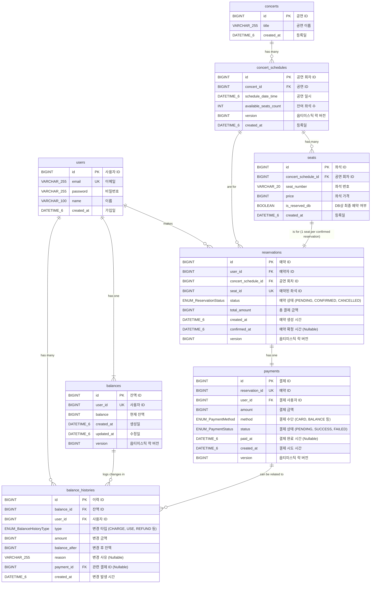

```mermaid
erDiagram
    users ||--o{ reservations : "makes"
    users ||--|{ balances : "has one"
    users ||--o{ balance_histories : "has many"
    
    concerts ||--o{ concert_schedules : "has many"

    concert_schedules ||--o{ seats : "has many"
    concert_schedules ||--o{ reservations : "are for"
    
    seats ||--|| reservations : "is for (1 seat per confirmed reservation)"
    
    reservations ||--|| payments : "has one"

    balances ||--o{ balance_histories : "logs changes in"
    payments ||--o{ balance_histories : "can be related to"

    users {
        BIGINT id PK "사용자 ID"
        VARCHAR_255 email UK "이메일"
        VARCHAR_255 password "비밀번호"
        VARCHAR_100 name "이름"
        DATETIME_6 created_at "가입일"
    }

    balances {
        BIGINT id PK "잔액 ID"
        BIGINT user_id UK "사용자 ID"
        BIGINT balance "현재 잔액"
        DATETIME_6 created_at "생성일"
        DATETIME_6 updated_at "수정일"
        BIGINT version "옵티미스틱 락 버전"
    }

    balance_histories {
        BIGINT id PK "이력 ID"
        BIGINT balance_id FK "잔액 ID"
        BIGINT user_id FK "사용자 ID"
        ENUM_BalanceHistoryType type "변경 타입 (CHARGE, USE, REFUND 등)"
        BIGINT amount "변경 금액"
        BIGINT balance_after "변경 후 잔액"
        VARCHAR_255 reason "변경 사유 (Nullable)"
        BIGINT payment_id FK "관련 결제 ID (Nullable)"
        DATETIME_6 created_at "변경 발생 시간"
    }

    concerts {
        BIGINT id PK "공연 ID"
        VARCHAR_255 title "공연 이름"
        DATETIME_6 created_at "등록일"
    }

    concert_schedules {
        BIGINT id PK "공연 회차 ID"
        BIGINT concert_id FK "공연 ID"
        DATETIME_6 schedule_date_time "공연 일시"
        INT available_seats_count "잔여 좌석 수"
        BIGINT version "옵티미스틱 락 버전"
        DATETIME_6 created_at "등록일"
    }

    seats {
        BIGINT id PK "좌석 ID"
        BIGINT concert_schedule_id FK "공연 회차 ID"
        VARCHAR_20 seat_number "좌석 번호"
        BIGINT price "좌석 가격"
        BOOLEAN is_reserved_db "DB상 최종 예약 여부"
        DATETIME_6 created_at "등록일"
    }

    reservations {
        BIGINT id PK "예약 ID"
        BIGINT user_id FK "예약자 ID"
        BIGINT concert_schedule_id FK "공연 회차 ID"
        BIGINT seat_id UK "예약된 좌석 ID"
        ENUM_ReservationStatus status "예약 상태 (PENDING, CONFIRMED, CANCELLED)"
        BIGINT total_amount "총 결제 금액"
        DATETIME_6 created_at "예약 생성 시간"
        DATETIME_6 confirmed_at "예약 확정 시간 (Nullable)"
        BIGINT version "옵티미스틱 락 버전"
    }

    payments {
        BIGINT id PK "결제 ID"
        BIGINT reservation_id UK "예약 ID"
        BIGINT user_id FK "결제 사용자 ID"
        BIGINT amount "결제 금액"
        ENUM_PaymentMethod method "결제 수단 (CARD, BALANCE 등)"
        ENUM_PaymentStatus status "결제 상태 (PENDING, SUCCESS, FAILED)"
        DATETIME_6 paid_at "결제 완료 시간 (Nullable)"
        DATETIME_6 created_at "결제 시도 시간"
        BIGINT version "옵티미스틱 락 버전"
    }
```