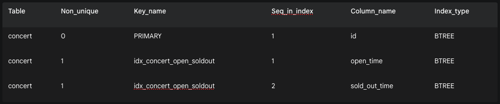

## 데이터베이스 성능 최적화: 복합 인덱스 추가 및 결과 해석
## 1. 복합 인덱스를 추가한 이유
   애플리케이션에서 "현재 예약 가능한 콘서트 목록"을 조회하는 기능은 사용자가 가장 빈번하게 호출하는 핵심 기능 중 하나입니다. 이 기능은 아래와 같은 SQL 쿼리를 통해 실행됩니다.
```sql
SELECT * FROM CONCERT
WHERE open_time <= '2025-07-21 22:38:00' AND sold_out_time IS NULL; 
```

콘서트 데이터가 수백만 건으로 증가할 경우, 데이터베이스는 이 두 가지 조건(open_time, sold_out_time)을 만족하는 데이터를 찾기 위해 테이블의 모든 행을 처음부터 끝까지 다 확인하는 **풀 테이블 스캔(Full Table Scan)**을 수행하게 됩니다. 이는 시스템에 엄청난 부하를 주어 심각한 성능 저하를 유발합니다.

이 문제를 해결하기 위해, open_time과 sold_out_time 두 컬럼을 묶어 하나의 **복합 인덱스(Composite Index)**로 생성했습니다.

복합 인덱스는 데이터베이스가 마치 책의 '찾아보기' 페이지처럼, 두 가지 조건을 동시에 사용하여 원하는 데이터를 매우 빠르고 효율적으로 찾을 수 있도록 돕는 역할을 합니다.

## 2. 인덱스 생성 및 확인 방법
### 인덱스 생성
   MySQL Workbench, DBeaver와 같은 DB 클라이언트 툴이나 Flyway와 같은 마이그레이션 도구를 통해 아래의 SQL 명령어를 실행하여 인덱스를 생성합니다.
```sql
CREATE INDEX idx_concert_open_soldout ON CONCERT (open_time, sold_out_time);
```

### 인덱스 확인
인덱스가 정상적으로 생성되었는지 확인하기 위해 아래의 SQL 명령어를 실행합니다.
```sql
SHOW INDEX FROM concert;
```

## 3. SHOW INDEX 결과 해석
   위 확인 명령어를 실행하면 아래와 같은 결과 테이블을 볼 수 있습니다.



### 각 열의 의미는 다음과 같습니다.

* Table: 인덱스가 속한 테이블의 이름입니다.

* Non_unique: 0이면 중복 값을 허용하지 않는 고유(Unique) 인덱스, 1이면 중복을 허용하는 일반 인덱스입니다.

* Key_name: 인덱스의 고유한 이름입니다. PRIMARY는 기본 키(Primary Key)를 의미합니다.

* Seq_in_index: 복합 인덱스에서 가장 중요한 열입니다. 인덱스에 포함된 컬럼의 순서를 나타냅니다. 1이 첫 번째 기준, 2가 두 번째 기준입니다.

* Column_name: 인덱스가 적용된 컬럼의 이름입니다.

* Index_type: 인덱스의 알고리즘 종류입니다. BTREE가 가장 일반적으로 사용됩니다.

### 결과 분석

1. 첫 번째 줄 (기본 키)

* concert 테이블에는 PRIMARY라는 이름의 고유 인덱스가 있으며, id 컬럼에 적용되어 있습니다.

2. 두 번째와 세 번째 줄 (복합 인덱스)

* 두 줄 모두 Key_name이 idx_concert_open_soldout으로 동일합니다. 이는 이 두 줄이 하나의 복합 인덱스를 설명하고 있음을 의미합니다.

* Seq_in_index를 보면, 이 인덱스는 2개의 컬럼으로 구성되어 있습니다.

  1. 첫 번째 정렬 기준(Seq_in_index = 1)은 open_time 입니다.

  2. 두 번째 정렬 기준(Seq_in_index = 2)은 sold_out_time 입니다.

### 결론
SHOW INDEX 결과를 통해 concert 테이블에 open_time과 sold_out_time을 순서대로 묶은 idx_concert_open_soldout 복합 인덱스가 성공적으로 생성되었음을 확인할 수 있습니다.

이제 데이터베이스는 예약 가능한 콘서트를 조회할 때, 이 인덱스를 사용하여 풀 테이블 스캔 없이 매우 빠르게 원하는 데이터를 찾을 수 있게 되어 조회 성능이 크게 향상됩니다.