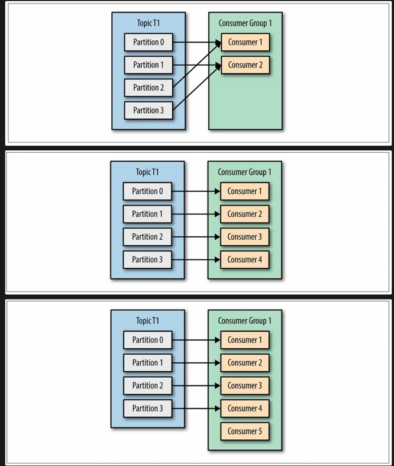
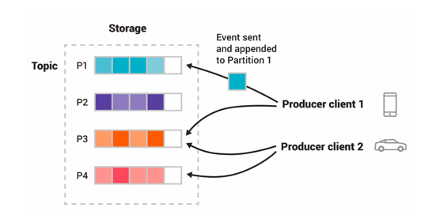

# **Kafka 란?**
**대규모 실시간 데이터 스프리밍을 위한 분산 메세징 시스템**

높은 처리량 및 개발 효율을 위한 분산 시스템에서 고가용성과 유연함이 필요할때 사용됨.

---

# **Kafka 의 구성 요소**

## **1. Producer & Consumer**
### **Producer**
> 이벤트를 생성하여 브로커에 발행(Publish)하는 주체

### **Consumer**
> 이벤트를 구독(Subscribe)하여 읽고 처리하는 주체

#### **Consumer Group**
> 특정 토픽을 함께 구독하는 컨슈머들의 논리적인 단위 (주로 하나의 서비스)
- Topic 을 구독하는 하나의 단위이며 보통 하나의 서비스를 제공합니다.
- Consumer Group 내의 Consumer(인스턴스)들이 Event 를 병렬 처리하며 수평 확장이 가능합니다.
- 하나의 Partition 은 하나의 Consumer 로만 Event 를 전달하며 Consumer 는 여러 Partition 에서 Event 읽기가 가능합니다.

---

## **2. Broker & Cluster**
### **Broker**
> Kafka 가 설치된 물리적인 서버 단위

- **Controller**: 클러스터 메타데이터 관리, 파티션 리더 선출 등 클러스터 전체를 관리합니다.
- **Coordinator**: 컨슈머 그룹의 리밸런싱 및 오프셋 관리를 담당합니다.
- **Bootstrap Servers**: 클라이언트가 Kafka 클러스터에 처음 연결할 때 사용하는 브로커 목록입니다.

### **Cluster**
> 여러 브로커를 묶어 구성한 하나의 Kafka 시스템
- 브로커 증설을 통해 유연하게 확장할 수 있습니다.

---

## **3. Topic, Partition & Message**
### **Topic**
> 이벤트(메시지)를 분류하는 논리적인 단위

### **Partition**
> 토픽을 병렬 처리를 위해 물리적으로 나눈 단위

- 파티션 개수만큼 컨슈머가 동시에 메시지를 처리할 수 있습니다.
- **같은 Key 를 가진 메시지는 항상 같은 파티션**에 저장되어 처리 순서가 보장됩니다.
- Key 가 없으면 라운드 로빈 방식으로 파티션에 균등하게 분배됩니다.

### **Message (Event)**
> Producer 에서 Consumer 로 전달되는 데이터 단위
- `<Key, Value>` 형태로 구성되며, 레코드(Record)라고도 불립니다.

---

## **4. 핵심 동작 원리**
### **Replication**
> 파티션 데이터를 여러 브로커에 복제하여 데이터 유실을 방지하고 가용성을 높이는 기능

- **Leader Partition**: 모든 읽기/쓰기 요청을 처리하는 원본입니다.
- **Follower Partition**: 리더를 복제하며 대기하는 복제본으로, 리더에 장애가 발생하면 새로운 리더가 됩니다.

### **Re balancing**
> 컨슈머 그룹 내 컨슈머가 변경될 때, 각 컨슈머가 담당할 파티션을 재분배하는 과정
- 리밸런싱이 진행되는 동안에는 일시적으로 메시지 처리가 중단될 수 있습니다.

### **Offset**
> 각 컨슈머 그룹이 특정 파티션의 메시지를 어디까지 읽었는지 기록하는 위치 정보

---

# **장점 및 단점**

## ✅ **장점**
- **고성능 및 높은 처리량**: 디스크에 순차적으로 데이터를 저장하고, 분산 처리를 통해 대용량의 이벤트를 빠르게 처리할 수 있습니다.
- **확장성**: 운영 중에도 브로커를 추가하여 클러스터를 수평적으로 쉽게 확장할 수 있습니다.
- **내구성 및 가용성**: Replication 기능을 통해 데이터 유실을 방지하고, 브로커 장애 시에도 서비스를 중단 없이 운영할 수 있습니다.
- **느슨한 결합**: Producer 와 Consumer 가 서로를 몰라도 Topic 을 통해 통신하므로 시스템의 유연성이 높아집니다.

## ❌ **단점**
- **운영 및 설정의 복잡성**: Zookeeper(또는 KRaft 모드)를 포함한 분산 시스템이므로 초기 설정과 운영에 대한 이해가 필요합니다.
- **높은 학습 곡선**: Broker, Topic, Partition, Consumer Group 등 Kafka 고유의 개념에 대한 학습이 필요합니다.
- **리밸런싱 시 일시적 중단**: Consumer Group 에 변화가 생겨 리밸런싱이 발생하면 해당 그룹은 잠시 동안 메시지를 처리할 수 없습니다.