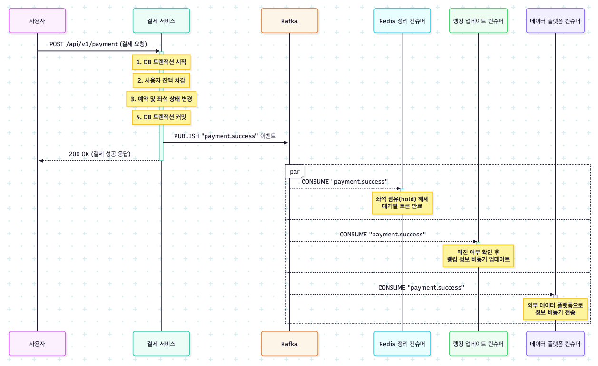

결제 후처리 개선을 위한 Kafka 기반 이벤트 아키텍처 설계
1. 문제 정의: 대용량 트래픽 발생 지점
   현재 시스템에서 대규모 트래픽이 예상되는 가장 핵심적인 지점은 '결제 성공' 이벤트가 발생하는 시점입니다.
   콘서트 티켓팅과 같이 수많은 사용자가 동시에 결제를 완료하는 상황에서, 결제 성공 직후에 동기적으로 처리해야 하는 작업들이 많아질수록 API 응답 시간이 길어지고 시스템 전체에 부하가 집중됩니다.
* 현재의 후처리 작업 목록:
    1. 좌석 임시 점유(hold) 정보 해제 (Redis)
    2. 활성 대기열 토큰 만료 (Redis)
    3. 콘서트 날짜별 매진 랭킹 업데이트 (Redis & DB)
    4. 외부 데이터 분석 플랫폼으로 정보 전송 (외부 API 호출)
       이러한 작업들을 결제 API의 응답 전에 모두 동기적으로 처리한다면, 랭킹 업데이트가 느려지거나 외부 API 호출이 지연될 경우 사용자에게 결제 성공 응답이 늦게 전달되는 심각한 문제가 발생할 수 있습니다.
2. 개선 목표
* API 응답 시간 최소화: 결제라는 핵심 비즈니스 로직만 처리한 뒤, 사용자에게 즉시 성공 응답을 반환합니다.
* 결합도 감소: 결제 서비스는 후처리 작업을 수행하는 다른 서비스들의 존재나 상태를 알 필요가 없도록 시스템을 분리합니다.
* 안정성 및 확장성 확보: 특정 후처리 작업의 실패가 다른 작업이나 전체 시스템에 영향을 주지 않도록 격리하고, 향후 새로운 후처리 기능(예: 알림 발송)을 쉽게 추가할 수 있는 구조를 만듭니다.
3. Kafka 도입 이유
   위 목표를 달성하기 위해, Apache Kafka를 이용한 이벤트 기반 아키텍처를 도입합니다.
* 비동기 처리 (Asynchronous): 결제 서비스는 '결제가 성공했다'는 이벤트만 Kafka에 발행하고 즉시 자신의 작업을 종료할 수 있습니다. 이를 통해 API 응답 시간을 크게 단축시킬 수 있습니다.
* 결합도 감소 (Decoupling): 결제 서비스는 어떤 서비스들이 이 이벤트를 구독하는지 전혀 알 필요가 없습니다. 각 후처리 서비스들은 필요한 이벤트를 스스로 구독하여 독립적으로 동작하므로, 서비스 간의 의존성이 제거됩니다.
* 안정성 (Reliability): 만약 랭킹 업데이트 서비스가 일시적으로 장애가 나더라도, 이벤트는 Kafka에 안전하게 보관됩니다. 서비스가 복구된 후, 중단되었던 시점부터 다시 이벤트를 처리할 수 있어 데이터 유실을 방지합니다.
* 확장성 (Scalability): 나중에 "결제 성공 시 사용자에게 이메일 알림 발송"이라는 새로운 기능이 필요하다면, payment.success 토픽을 구독하는 새로운 컨슈머를 만들기만 하면 됩니다. 기존의 결제 서비스 코드는 전혀 수정할 필요가 없습니다.
4. 비즈니스 시퀀스 다이어그램 (개선 후)
   결제 서비스가 이벤트를 발행하면, 각 후처리 서비스들이 독립적으로 이벤트를 구독하여 병렬로 작업을 처리하는 코레오그래피(Choreography) 패턴을 따릅니다.

5. Kafka 구성
* 토픽 (Topics):
    * payment.success: 결제가 성공했을 때 발행되는 이벤트
    * payment.failed: 결제가 실패했을 때 발행되는 이벤트
    * reservation.created: 예약이 생성되었을 때 발행되는 이벤트
* 프로듀서 (Producer):
    * PaymentInteractor: 결제 성공/실패 시 이벤트를 발행합니다.
    * ReservationInteractor: 예약 생성 시 이벤트를 발행합니다.
* 컨슈머 그룹 (Consumer Groups): 각기 다른 책임을 가진 컨슈머들이 이벤트를 중복 없이, 그리고 누락 없이 수신할 수 있도록 아래와 같이 고유한 그룹 ID를 할당합니다.
  컨슈머 클래스	구독 토픽	컨슈머 그룹 ID (application.yml)	역할
  ConcertSoldOutRankConsumer	payment.success	ranking-update-group	콘서트 매진 랭킹 업데이트
  DataPlatformConsumer	payment.success	data-platform-group	외부 데이터 플랫폼 전송
  PostPaymentRedisCleanupConsumer	payment.success, payment.failed	post-payment-cleanup-group	Redis 임시 데이터 정리
  PaymentFailureDbCompensationConsumer	payment.failed	payment-compensator-group	DB 데이터 보상 처리
  ReservationCreatedSeatLockConsumer	reservation.created	reservation-created-group	Redis 좌석 임시 점유
6. 기대 효과
* 사용자 경험 향상: 결제 API의 평균 응답 시간이 크게 단축됩니다.
* 시스템 안정성 증대: 특정 후처리 서비스의 장애가 결제라는 핵심 기능에 영향을 주지 않아, 시스템 전체가 더 안정적으로 운영됩니다.
* 유연한 아키텍처: 새로운 비즈니스 요구사항이 발생했을 때, 기존 코드를 수정하지 않고 새로운 컨슈머를 추가하는 것만으로 기능을 쉽게 확장할 수 있습니다.
