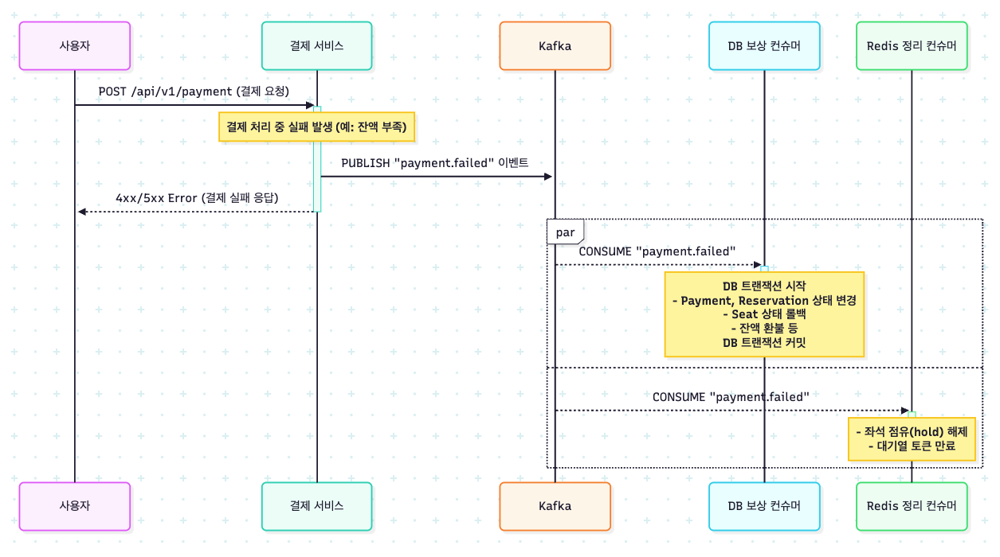

결제 실패 보상 처리를 위한 Kafka 기반 이벤트 아키텍처 설계
1. 문제 정의: 분산된 데이터의 일관성 있는 롤백
   사용자의 결제가 실패했을 경우, 예약 과정에서 변경되었던 여러 시스템의 데이터들을 **원래 상태로 되돌리는 보상 트랜잭션(Compensation Transaction)**이 반드시 실행되어야 합니다.
* 롤백 대상 데이터:
    1. 데이터베이스:
        * Payment 레코드 상태를 FAILED로 변경
        * Reservation 레코드 상태를 FAILED로 변경
        * Seat 상태를 RESERVED에서 AVAILABLE로 변경
        * ConcertDate의 availableSeatCount를 1 증가
        * (필요 시) User의 차감된 잔액을 환불
    2. Redis:
        * 임시 점유된 좌석 정보(hold) 삭제
        * 활성 상태였던 대기열 토큰 만료 처리
          이러한 복잡한 롤백 과정을 결제 실패 API가 동기적으로 모두 처리한다면, 특정 DB 작업이나 Redis 연결에 지연이 발생했을 때 사용자에게 실패 응답이 늦게 전달되고, 결제 서비스가 너무 많은 다른 서비스에 의존하게 되는 문제가 발생합니다.
2. 개선 목표
* 빠른 실패 응답: 결제 실패가 확정되는 즉시, 사용자에게 빠르게 실패 결과를 응답합니다.
* 신뢰성 있는 데이터 복구: 결제 실패와 관련된 모든 데이터(DB, Redis)가 최종적으로는 반드시 일관된 상태로 복구되는 것을 보장합니다.
* 장애 격리: DB 롤백 작업의 실패가 Redis 정리 작업에 영향을 주지 않는 등, 각 보상 처리 작업이 독립적으로 실행되도록 하여 장애의 전파를 막습니다.
3. Kafka 도입 이유
   위 목표를 달성하기 위해, Apache Kafka를 이용한 이벤트 기반 아키텍처를 도입합니다.
* 비동기 보상 처리: 결제 서비스는 "결제가 실패했다"는 payment.failed 이벤트만 Kafka에 발행하고, 즉시 사용자에게 실패 응답을 반환할 수 있습니다. 복잡한 데이터 롤백 과정은 백그라운드에서 비동기적으로 처리됩니다.
* 결합도 감소 (코레오그래피 패턴): 결제 서비스는 어떤 시스템이 보상 처리를 해야 하는지 알 필요가 없습니다. 'DB 롤백'을 책임지는 컨슈머와 'Redis 정리'를 책임지는 컨슈머가 독립적으로 payment.failed 이벤트를 구독하여 각자의 임무를 수행합니다.
* 데이터 유실 방지: 만약 DB 롤백 컨슈머가 일시적인 장애 상태이더라도, payment.failed 이벤트는 Kafka에 안전하게 보관됩니다. 컨슈머가 복구된 후 중단되었던 시점부터 다시 이벤트를 처리하여, 데이터 정합성이 깨지는 상황을 방지합니다.
4. 비즈니스 시퀀스 다이어그램 (개선 후)
   결제 서비스가 실패 이벤트를 발행하면, 각기 다른 책임을 가진 컨슈머들이 독립적으로 이벤트를 구독하여 병렬로 보상 처리를 수행합니다.
   

5. Kafka 구성
* 핵심 토픽 (Topic):
    * payment.failed: 결제가 실패했을 때 보상 처리를 위해 발행되는 이벤트
* 프로듀서 (Producer):
    * PaymentInteractor: 결제 로직 처리 중 실패가 발생했을 때 payment.failed 이벤트를 발행합니다.
* 컨슈머 그룹 (Consumer Group): 결제 실패 후 필요한 각기 다른 보상 처리를 위해 컨슈머 그룹을 명확하게 분리합니다.
  컨슈머 클래스	구독 토픽	컨슈머 그룹 ID (application.yml)	역할
  PaymentFailureDbCompensationConsumer	payment.failed	payment-compensator-group	DB 데이터의 상태를 원상 복구
  PostPaymentRedisCleanupConsumer	payment.failed	post-payment-cleanup-group	Redis에 남아있는 임시 데이터 정리
6. 기대 효과
* 사용자 경험 향상: 결제 실패 시 불필요한 대기 시간 없이 즉각적으로 피드백을 받을 수 있습니다.
* 시스템 안정성 증대: DB나 Redis 중 한쪽에 일시적인 장애가 발생하더라도, 다른 쪽의 보상 처리는 정상적으로 수행되어 장애가 전파되는 것을 막습니다.
* 최종 일관성 보장: Kafka의 재처리 메커니즘을 통해, 모든 보상 트랜잭션이 결국에는 실행되는 것을 보장하여 시스템의 데이터 정합성을 높은 수준으로 유지합니다.
