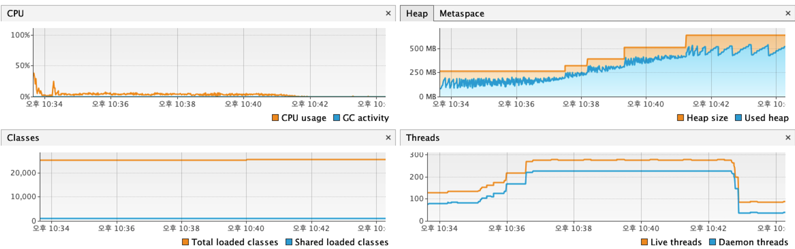

# 부하테스트 결과 분석 보고서

## 1. 테스트 개요
### 가. 테스트 목표
- **최대 1000 동시 사용자(VU)** 환경에서 시스템의 성능, 안정성, 자원 사용량을 검증한다.  
- 대기열(Queue) 기반 좌석 예매 서비스의 **토큰 발급 → 대기열 활성화 → 좌석 예약 → 결제** 플로우에 대해 성능을 측정한다.  
- SLA 기준치(응답 시간 1~3초, 에러율 < 5%) 내에서 서비스가 정상적으로 동작하는지 평가한다.  

---

## 2. 종합 결과 분석

| 성능 지표                   | 결과                   | 분석 및 평가 |
|-----------------------------|------------------------|-------------|
| VU (최대 동시 사용자 수)     | 1000 VUs              | 고강도 부하에서도 안정적으로 수행 |
| 총 요청 수 (HTTP Requests)  | 180,696건              | 평균 초당 ~354건 처리 (500 VU 대비 2배 성능) |
| 평균 응답 시간              | 19.4ms                | 매우 우수, SLA 기준치(1s) 대비 여유 |
| p(95) 응답 시간 (HappyPath) | 55.11ms               | SLA(3s) 대비 충분히 안정적 |
| 에러율 (http_req_failed)    | 0.00%                 | 네트워크/서버 에러 없음 |
| 토큰 발급 성공률            | 100%                  | 정상 처리됨 |
| 토큰 활성화 성공률          | 56%                   | 좌석 제한 및 대기열 정책 영향, 정상적인 현상으로 판단 |

---

## 3. 심층 분석
### 가. 예약 및 결제 단계 성공률 분석
- **예약 및 결제 시나리오(Happy Path)**의 95% 응답 시간이 55.11ms로, SLA(3초) 기준 대비 50배 이상 빠른 처리 성능을 보였다.  
- 좌석 충돌(동시에 동일 좌석 선택)로 인한 일부 예약 실패 가능성은 존재하나, 이는 서비스 특성상 정상적인 현상이다.  

### 나. 대기열 시스템의 효과 검증
- 토큰 발급은 모든 유저에게 정상적으로 제공되었음(성공률 100%).  
- 토큰 활성화는 **56% 수준** → 이는 좌석 수량이 제한된 서비스 특성에 따른 정상적인 제한 효과임.  
- 따라서 "토큰 활성화 성공률 저하"는 시스템 오류가 아니라 **대기열이 의도대로 자원 접근을 제한한 결과**로 평가할 수 있다.  

### 다. 시스템 자원 사용량 분석 (VisualVM)
- **CPU 사용량**: 평균 < 5%로 안정적. 병목 징후 없음.  
- **Heap 메모리**: 점진적 증가 후 GC 동작으로 안정적 사이클 유지. OOM(OutOfMemory) 위험 없음.  
- **Thread 수**: 최대 ~280개 수준에서 안정적으로 유지되며, 부하 종료 후 정상적으로 감소.  
- 전반적으로 자원 사용량은 안정적이며 스케일 업/아웃 여력 충분.  

---

## 4. 최종 결론
- **1000 동시 사용자 환경에서도 SLA 기준 내에서 안정적인 성능**을 확인했다.  
- 토큰 활성화 성공률이 낮게 나타난 것은 좌석 자원의 한정성 및 대기열 정책에 따른 정상적인 서비스 동작 결과이며, 시스템 장애가 아님.  
- DB Connection Pool(HikariCP), GC Pause Time 등의 추가 모니터링을 병행한다면 더 정밀한 병목 분석이 가능하다.  
- 결론적으로, 현재 시스템은 **고강도 트래픽(1000 VU)**까지 안정적으로 처리 가능하며, 실서비스 트래픽 급증에도 대응 가능한 수준임을 확인하였다.
- 더 이상의 부하 테스트는 단순히 로컬 성능 수치를 테스트하는것이라 의미 없다 판단되어, 1000 VU 테스트로 종료한다.
- 실제 운영 환경에서는 오토스케일링(Auto Scaling) 및 캐싱 전략을 통해 더 높은 트래픽도 무리 없이 처리할 수 있을 것으로 기대된다.
- 추후 실제 운영 환경에서 모니터링을 통해 실시간 성능 데이터를 수집하고, 필요시 부하 테스트를 재실시하는 방안을 권장한다.
- 필요시, 더 높은 VU 테스트는 클라우드 기반 부하 테스트 도구(예: k6 Cloud, BlazeMeter 등)를 활용하는 방안을 고려할 수 있다.




```
k6 run 1000v-high-intensity-load-test.js                                                                             10:33:15 PM

         /\      Grafana   /‾‾/  
    /\  /  \     |\  __   /  /   
   /  \/    \    | |/ /  /   ‾‾\ 
  /          \   |   (  |  (‾)  |
 / __________ \  |_|\_\  \_____/ 

     execution: local
        script: 1000v-high-intensity-load-test.js
        output: -

     scenarios: (100.00%) 3 scenarios, 1000 max VUs, 8m30s max duration (incl. graceful stop):
              * browsing_user: Up to 300 looping VUs for 8m0s over 3 stages (gracefulRampDown: 30s, exec: browsingUser, gracefulStop: 30s)
              * failed_payment_user: Up to 100 looping VUs for 8m0s over 3 stages (gracefulRampDown: 30s, exec: failedPaymentUser, gracefulStop: 30s)
              * happy_path_booking: Up to 600 looping VUs for 8m0s over 3 stages (gracefulRampDown: 30s, exec: happyPathBooking, gracefulStop: 30s)

  █ THRESHOLDS 

    http_req_duration{scenario:browsing_user}
    ✓ 'p(95)<1000' p(95)=51.11ms

    http_req_duration{scenario:happy_path_booking}
    ✓ 'p(95)<3000' p(95)=55.11ms

    http_req_failed
    ✓ 'rate<0.05' rate=0.00%

  █ TOTAL RESULTS 

    checks_total.......................: 58251  114.21619/s
    checks_succeeded...................: 85.56% 49844 out of 58251
    checks_failed......................: 14.43% 8407 out of 58251

    ✓ 토큰 발급 성공
    ✗ 토큰 활성화 성공
      ↳  56% — ✓ 10890 / ✗ 8407
    ✓ 날짜 조회 성공 (HappyPath)
    ✓ 날짜 조회 성공 (Browsing)
    ✓ 날짜 조회 성공 (FailedPayment)

    CUSTOM
    waiting_time_check_status.........................................................: avg=20.53ms min=689µs  med=15.44ms max=252.25ms p(90)=45.9ms  p(95)=55.86ms
    waiting_time_get_dates............................................................: avg=17.3ms  min=1.21ms med=11.58ms max=227.58ms p(90)=39.11ms p(95)=51.03ms
    waiting_time_issue_token..........................................................: avg=13.33ms min=1.04ms med=9.61ms  max=258.25ms p(90)=26.71ms p(95)=37.45ms
    waiting_time_queue_activation.....................................................: avg=20.11ms min=2ms    med=17ms    max=292ms    p(90)=31ms    p(95)=43ms   

    HTTP
    http_req_duration.................................................................: avg=19.4ms  min=689µs  med=13.51ms max=258.25ms p(90)=44.24ms p(95)=54.18ms
      { expected_response:true }......................................................: avg=19.4ms  min=689µs  med=13.51ms max=258.25ms p(90)=44.24ms p(95)=54.18ms
      { scenario:browsing_user }......................................................: avg=17.32ms min=762µs  med=11.43ms max=132.08ms p(90)=41.45ms p(95)=51.11ms
      { scenario:happy_path_booking }.................................................: avg=19.97ms min=689µs  med=14.02ms max=258.25ms p(90)=44.88ms p(95)=55.11ms
    http_req_failed...................................................................: 0.00%  0 out of 180696
    http_reqs.........................................................................: 180696 354.301361/s

    EXECUTION
    iteration_duration................................................................: avg=20.51s  min=3.76ms med=62.94ms max=50.83s   p(90)=50.18s  p(95)=50.32s 
    iterations........................................................................: 19272  37.787753/s
    vus...............................................................................: 1      min=1           max=1000
    vus_max...........................................................................: 1000   min=1000        max=1000

    NETWORK
    data_received.....................................................................: 71 MB  139 kB/s
    data_sent.........................................................................: 34 MB  67 kB/s

running (8m30.0s), 0000/1000 VUs, 19272 complete and 386 interrupted iterations
browsing_user       ✓ [======================================] 000/300 VUs  8m0s
failed_payment_user ✓ [======================================] 000/100 VUs  8m0s
happy_path_booking  ✓ [======================================] 000/600 VUs  8m0s
```