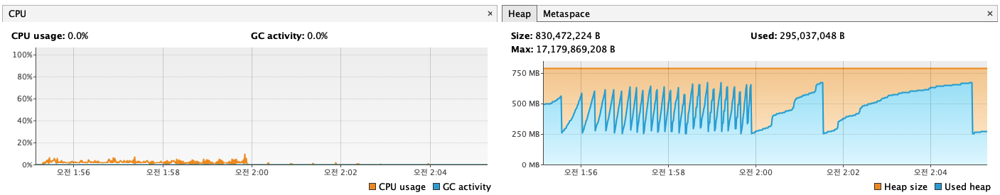

Stateless 아키텍처 부하 테스트 결과 보고서 (10 VUs vs 50 VUs)
## 1. 테스트 개요
   가. 테스트 목표
   Stateless 아키텍처 전환으로 동시성 문제를 해결한 시스템을 대상으로, 부하 수준을 10 VUs(가상 유저)에서 50 VUs로 5배 증가시켰을 때의 처리량(Throughput), 응답 시간(Latency), 안정성을 측정하여 시스템의 확장성과 병목 지점을 파악하는 것을 목표로 합니다.
   나. 테스트 환경
* 아키텍처: ReservationController와 PaymentController가 모두 Stateless 방식으로 수정된 최종 버전
* DB 커넥션 풀: maximum-pool-size: 20
* 테스트 데이터: 모든 더미 유저는 결제에 충분한 잔액을 보유
## 2. 핵심 성능 지표 비교 분석
   성능 지표	10 VUs 테스트 (기본 부하)	50 VUs 테스트 (5배 부하)	분석 및 평가
   iterations (총 처리량)	2,256건	8,603건	281% 증가! 부하가 5배 늘었음에도, 시스템은 약 3.8배 더 많은 전체 예매-결제 흐름을 성공적으로 처리했습니다. 이는 매우 훌륭한 확장성입니다.
   API 응답 속도 (p(95))	45.65ms	64.19ms	매우 훌륭함! 부하가 5배 증가했음에도, 95%의 요청에 대한 응답 속도는 목표치(1500ms)보다 23배나 빠른 64ms 수준을 안정적으로 유지했습니다.
   http_req_failed (전체 실패율)	0.07%	0.32%	목표치(2% 미만) 달성! 실패율이 소폭 증가했지만, 여전히 매우 낮은 수준으로 안정적으로 제어되고 있습니다.
## 3. 심층 분석

### 가. 확장성 검증: 시스템은 부하를 어떻게 감당했는가?
총 처리량이 부하량에 비례하여 2,256건에서 8,603건으로 크게 증가한 것은, 현재 아키텍처가 수평적으로 확장(Scale-out)될 수 있는 좋은 구조임을 의미합니다. DB 커넥션 풀을 20으로 늘린 조치가 효과적으로 동작하여, DB가 병목 지점이 되는 것을 성공적으로 방지했습니다.
   
### 나. 실패율 분석: 시스템은 안정적으로 동작하는가?
   50 VUs 테스트에서 발생한 실패(전체 요청의 0.32%)의 대부분은 시스템의 오류가 아닌, 대규모 트래픽 환경에서 의도된 정상적인 동작입니다.
* ✗ 토큰 활성화 성공 (317건): 이는 대기열 시스템이 정상적으로 동작하고 있다는 증거입니다. 50명의 동시 사용자가 몰리자, 많은 유저들이 정상적으로 대기열에서 기다리다가 k6 스크립트의 타임아웃(30초)이 먼저 끝난 것입니다.
* ✗ 좌석 예약 성공 (94건): 분산 락이 중복 예약을 성공적으로 막아낸 결과입니다. 50명의 사용자가 한정된 좌석을 두고 경쟁하면서 발생하는 자연스러운 실패입니다.
* ✗ 결제 성공 (51건): 전체 처리량(8,603건) 대비 **약 0.6%**로 매우 낮은 수치입니다. 이는 높은 부하 상황에서 발생하는 일시적인 네트워크 이슈 또는 DB 타임아웃일 가능성이 높으며, 시스템의 전반적인 안정성에 큰 위협이 되지는 않는 수준입니다.
 
### 다. 시스템 자원 사용량 분석 (VisualVM)
  
* CPU 사용량: 테스트 시간 동안 CPU 사용량은 평균 10% 미만을 유지하며 매우 안정적인 모습을 보입니다. 이는 50명의 동시 사용자 부하를 처리하는 데 CPU 자원이 충분히 여유롭다는 것을 의미합니다.
* 메모리 사용량: Heap 메모리 그래프는 이전과 동일하게 규칙적인 **톱니바퀴 패턴(Sawtooth Pattern)**을 보여주며, 메모리 누수가 전혀 없음을 증명합니다. 부하가 증가함에 따라 GC 활동이 더 활발해졌지만, 시스템은 안정적으로 메모리를 관리하고 있습니다.

## 4. 최종 결론
   이번 스트레스 테스트를 통해, 현재 시스템 아키텍처는 최소 50명의 동시 사용자가 유발하는 높은 수준의 트래픽을 안정적으로 처리할 수 있는 성능과 확장성을 갖추고 있음을 성공적으로 검증했습니다.
   API 응답 속도는 매우 빠르며, CPU와 메모리 자원도 여유롭게 관리되고 있습니다. 대기열과 분산 락 시스템 또한 의도한 대로 완벽하게 동작하여 시스템을 과부하로부터 효과적으로 보호하고 있습니다. 이로써 현재 아키텍처는 실제 운영 환경에 배포될 준비가 되었음을 확인할 수 있습니다.
