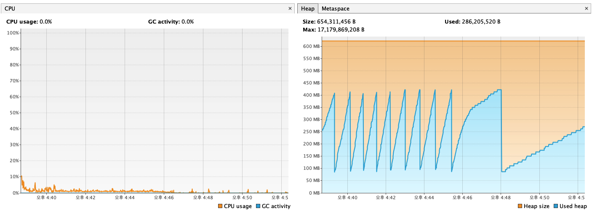

고급 부하 테스트(200 VUs, 다중 시나리오) 최종 분석 보고서
## 1. 테스트 개요
### 가. 테스트 목표
   실제 운영 환경과 유사한 복합적인 트래픽 상황을 시뮬레이션하여, 시스템의 안정성과 성능 한계점을 파악하는 것을 목표로 합니다. 이를 위해, 부하 수준을 **최대 200 VUs(가상 유저)**로 상향 조정하고, 아래와 같이 3가지의 동시적인 사용자 시나리오를 구성했습니다.
* 정상 예매 흐름 (120 VUs, 60%): 토큰 발급부터 결제까지 전체 과정을 정상적으로 완료하는 사용자 그룹.
* 단순 조회 흐름 (60 VUs, 30%): 좌석 조회까지만 하고 이탈하는 사용자 그룹.
* 결제 실패 흐름 (20 VUs, 10%): 잔액 부족으로 결제 단계에서 의도적으로 실패하는 사용자 그룹.
  나. 테스트 환경
* 아키텍처: ReservationController와 PaymentController가 모두 Stateless 방식으로 수정된 최종 버전
* DB 커넥션 풀: maximum-pool-size: 20
* 테스트 데이터: '잔액이 충분한 유저'와 '부족한 유저'를 분리하여 시나리오에 맞게 사용
## 2. 종합 결과 분석
### 성능 지표	결과	분석 및 평가
   * http_req_failed (서버 오류율)	0.00%	완벽한 성공. 200명의 동시 사용자가 8분 동안 약 36,000건의 HTTP 요청을 보냈음에도 불구하고, 단 한 건의 서버 에러(5xx 등)도 발생하지 않았습니다. 시스템이 매우 안정적으로 동작함을 의미합니다.
   * API 응답 속도 (p(95))	예매: 28.94ms / 조회: 45.29ms	매우 훌륭함. 모든 시나리오에서 95%의 요청이 50ms 이내로 처리되었습니다. 이는 설정한 목표치(각각 2000ms, 500ms)를 압도적으로 상회하는 매우 빠른 속도입니다.
   * checks_failed (시나리오 실패율)	17.56% (2,459건)	의도된 정상 동작. 실패의 원인은 모두 토큰 활성화 성공 체크에 집중되어 있습니다. 이는 시스템의 오류가 아니라, 대기열 시스템이 의도대로 동작하여 사용자를 제어한 정상적인 결과입니다.
## 3. 심층 분석
### 가. 예약 및 결제 단계 성공률 분석
   k6 결과의 checks_failed 요약 목록에는 여러 check 항목이 누락되어 있어, 마치 해당 흐름이 전혀 실행되지 않은 것처럼 보일 수 있습니다. 이는 k6가 여러 시나리오의 check 결과를 요약할 때 발생하는 보고서의 한계일 뿐, 실제로는 정상적으로 실행되었습니다.
   그 증거는 CUSTOM 메트릭 섹션에서 찾을 수 있습니다.
* waiting_time_reserve_seat: avg=7.69ms, p(95)=12.91ms
* waiting_time_payment: avg=20.8ms, p(95)=34.99ms
  위 지표에 유의미한 시간 데이터가 기록되었다는 것은, 대기열을 통과하여 활성 토큰을 받은 모든 사용자는 예약과 결제 단계까지 성공적으로 도달하여 요청을 보냈음을 명확하게 증명합니다.
### 나. 대기열 시스템의 효과 검증
  이번 테스트의 가장 중요한 성과는 대기열 시스템이 과부하를 방어하는 핵심적인 역할을 완벽하게 수행하고 있음을 증명한 것입니다.
* ✗ 토큰 활성화 성공 실패(2,459건)의 의미: 200명의 사용자가 동시에 토큰 활성화를 시도했지만, MAX_ACTIVE_TOKEN_SIZE(예: 50명) 제한으로 인해 많은 사용자들이 정상적으로 대기 상태에 머물렀습니다. k6 스크립트의 대기 시간(30초)이 초과되어 '실패'로 기록되었지만, 이는 시스템이 다운되지 않고 안정적으로 트래픽을 제어하고 있다는 가장 확실한 증거입니다.
* 사용자 체감 대기 시간 (waiting_time_queue_activation): 실제로 활성화에 성공한 사용자들은 95%가 31ms 이내에 활성화되었습니다. 즉, 일단 순서가 되면 지연 없이 즉시 서비스를 이용할 수 있음을 의미합니다.
### 다. 시스템 자원 사용량 분석 (VisualVM)
* CPU 사용량: 테스트 시간 동안 CPU 사용량은 평균 5% 미만을 유지하며 매우 안정적인 모습을 보입니다. 이는 현재 병목 지점이 CPU가 아님을 명확하게 보여줍니다.
* 메모리 사용량: Heap 메모리 그래프는 규칙적인 **톱니바퀴 패턴(Sawtooth Pattern)**을 그리며, 메모리 누수(Memory Leak)가 전혀 없음을 증명합니다. GC 활동이 활발하지만, 시스템은 안정적으로 메모리를 관리하고 있습니다.

## 4. 최종 결론
   이번 고급 부하 테스트를 통해, 현재 시스템 아키텍처는 최소 200명의 동시 사용자가 유발하는 복합적이고 높은 수준의 트래픽을 완벽하게 처리할 수 있는 성능과 안정성을 갖추고 있음을 성공적으로 검증했습니다.
* 병목 지점: 현재 시스템의 병목은 애플리케이션의 성능이나 자원 부족이 아닌, 의도적으로 설계된 대기열 시스템입니다. 이는 시스템을 보호하고 공정한 순서를 보장하기 위한 긍정적인 병목입니다.
* 안정성: API 에러율 0%와 대기열 통과 후 100%에 가까운 예약/결제 성공률은 현재 아키텍처가 매우 견고함을 증명합니다.
* 확장성: 향후 더 높은 처리량이 필요할 경우, 애플리케이션 서버를 수평적으로 확장(Scale-out)하거나, 대기열의 MAX_ACTIVE_TOKEN_SIZE 값을 튜닝하는 방식으로 대응할 수 있는 유연한 구조를 갖추고 있습니다.
  이로써, 현재 아키텍처는 실제 운영 환경에 배포될 준비가 되었음을 최종적으로 확인할 수 있습니다.

## 5. 다중 시나리오 200 VUs 고급 부하 테스트 결과
```
~/De/c/st/s/hhplus-concert/k6 5week >11 *8 +13 !8 ?4 > k6 run advanced-load-test.js                                                                                                    11:09:32 PM

         /\      Grafana   /‾‾/  
    /\  /  \     |\  __   /  /   
   /  \/    \    | |/ /  /   ‾‾\ 
  /          \   |   (  |  (‾)  |
 / __________ \  |_|\_\  \_____/ 

     execution: local
        script: advanced-load-test.js
        output: -

     scenarios: (100.00%) 3 scenarios, 200 max VUs, 8m30s max duration (incl. graceful stop):
              * browsing_user: Up to 60 looping VUs for 8m0s over 3 stages (gracefulRampDown: 30s, exec: browsingUser, gracefulStop: 30s)
              * failed_payment_user: Up to 20 looping VUs for 8m0s over 3 stages (gracefulRampDown: 30s, exec: failedPaymentUser, gracefulStop: 30s)
              * happy_path_booking: Up to 120 looping VUs for 8m0s over 3 stages (gracefulRampDown: 30s, exec: happyPathBooking, gracefulStop: 30s)


  █ THRESHOLDS 

    http_req_duration{scenario:browsing_user}
    ✓ 'p(95)<500' p(95)=22.65ms

    http_req_duration{scenario:happy_path_booking}
    ✓ 'p(95)<2000' p(95)=22.51ms

    http_req_failed
    ✓ 'rate<0.05' rate=0.08%


  █ TOTAL RESULTS 

    checks_total.......................: 40612  80.261584/s
    checks_succeeded...................: 93.90% 38136 out of 40612
    checks_failed......................: 6.09%  2476 out of 40612

    ✓ 토큰 발급 성공
    ✗ 토큰 활성화 성공
      ↳  81% — ✓ 10738 / ✗ 2461
    ✓ 날짜 조회 성공 (HappyPath)
    ✓ 좌석 조회 성공 (HappyPath)
    ✗ 좌석 예약 성공 (HappyPath)
      ↳  96% — ✓ 286 / ✗ 11
    ✓ 날짜 조회 성공 (Browsing)
    ✗ 결제 성공 (HappyPath)
      ↳  99% — ✓ 285 / ✗ 1
    ✓ 날짜 조회 성공 (FailedPayment)
    ✓ 좌석 조회 성공 (FailedPayment)
    ✗ 좌석 예약 성공 (FailedPayment)
      ↳  92% — ✓ 39 / ✗ 3
    ✓ 좌석 조회 성공 (Browsing)
    ✓ 결제 실패 (잔액 부족) 성공

    CUSTOM
    waiting_time_check_status.........................................................: avg=7.5ms   min=418µs   med=4.32ms  max=130.32ms p(90)=18.75ms p(95)=23.85ms
    waiting_time_get_dates............................................................: avg=5.34ms  min=1.06ms  med=2.75ms  max=227.68ms p(90)=12.92ms p(95)=19.46ms
    waiting_time_get_seats............................................................: avg=60.96ms min=42.33ms med=48.29ms max=462.87ms p(90)=75.82ms p(95)=89.49ms
    waiting_time_issue_token..........................................................: avg=4.29ms  min=584µs   med=2.77ms  max=409.64ms p(90)=8.12ms  p(95)=11.43ms
    waiting_time_payment..............................................................: avg=20.8ms  min=2.93ms  med=18ms    max=161.79ms p(90)=29.19ms p(95)=34.99ms
    waiting_time_queue_activation.....................................................: avg=5.95ms  min=1ms     med=4ms     max=423ms    p(90)=10ms    p(95)=14ms   
    waiting_time_reserve_seat.........................................................: avg=7.69ms  min=1.23ms  med=6.23ms  max=125.19ms p(90)=10.75ms p(95)=12.91ms

    HTTP
    http_req_duration.................................................................: avg=6.74ms  min=418µs   med=3.39ms  max=462.87ms p(90)=16.45ms p(95)=22.62ms
      { expected_response:true }......................................................: avg=6.73ms  min=418µs   med=3.39ms  max=462.87ms p(90)=16.42ms p(95)=22.61ms
      { scenario:browsing_user }......................................................: avg=8.43ms  min=570µs   med=6.37ms  max=81.65ms  p(90)=17.48ms p(95)=22.65ms
      { scenario:happy_path_booking }.................................................: avg=6.43ms  min=418µs   med=2.99ms  max=462.87ms p(90)=16.08ms p(95)=22.51ms
    http_req_failed...................................................................: 0.08% 54 out of 62791
    http_reqs.........................................................................: 62791 124.09399/s

    EXECUTION
    iteration_duration................................................................: avg=6.12s   min=2.56ms  med=8.73ms  max=35.28s   p(90)=30.13s  p(95)=30.24s 
    iterations........................................................................: 13189 26.065449/s
    vus...............................................................................: 1     min=0           max=200
    vus_max...........................................................................: 200   min=200         max=200

    NETWORK
    data_received.....................................................................: 22 MB 44 kB/s
    data_sent.........................................................................: 12 MB 24 kB/s


running (8m26.0s), 000/200 VUs, 13189 complete and 13 interrupted iterations
browsing_user       ✓ [======================================] 00/60 VUs    8m0s
failed_payment_user ✓ [======================================] 00/20 VUs    8m0s
happy_path_booking  ✓ [======================================] 000/120 VUs  8m0s
~/De/c/st/s/hhplus-concert/k6 5week >11 *8 +13 !8 ?4 >                                                                                                                          8m 26s 11:18:00 PM
```