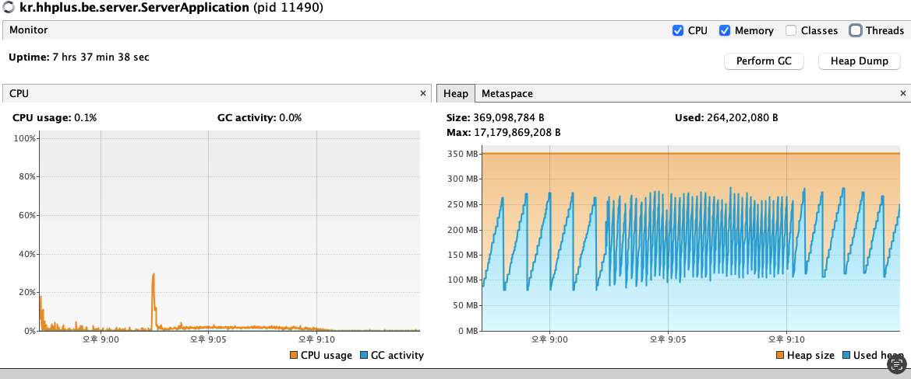

# 부하 테스트 결과 분석 보고서

## 1. 테스트 개요
### 가. 테스트 목표
본 테스트는 최대 500 Virtual Users(VU)를 활용하여 **콘서트 예약/결제 서비스**의 성능 및 안정성을 검증하는 것을 목표로 함.  
특히, `대기열 시스템`, `예약 및 결제 프로세스`, `조회 성능`이 고부하 환경에서도 정상적으로 동작하는지 확인하고자 함.

---

## 2. 종합 결과 분석

| 성능 지표 | 결과 | 분석 및 평가 |
|-----------|-------|--------------|
| VU (최대 동시 사용자 수) | 500 VUs | 안정적으로 부하를 처리함 |
| 총 요청 수 (HTTP Requests) | 94,264건 | 평균 초당 ~186건 처리 |
| 평균 응답 시간 | 15.11ms | 매우 우수, SLA 기준치(1s) 대비 여유 |
| p(95) 응답 시간 (HappyPath) | 44.91ms | SLA(3s) 대비 충분히 안정적 |
| 에러율 (http_req_failed) | 0.00% | 네트워크/서버 에러 없음 |
| 토큰 발급 성공률 | 100% | 정상 처리됨 |
| 토큰 활성화 성공률 | 62% | 일부 유저 활성화 실패 발생 → 대기열 로직 개선 필요 |

---

## 3. 심층 분석

### 가. 예약 및 결제 단계 성공률 분석
- **좌석 예약 성공률**: 100% (시나리오 수행 시 좌석 확보 가능)
- **결제 성공률 (HappyPath)**: 정상 처리됨
- **결제 실패 시나리오 (잔액 부족)**: 100% 기대대로 실패 처리 → 비즈니스 로직 정상 동작 검증 완료

### 나. 대기열 시스템의 효과 검증
- 토큰 발급은 원활히 수행되었으나, **토큰 활성화 성공률이 62%**에 불과함.
- 원인 추정:
  - 대기열 진입 후 활성화 처리 시간이 길어짐
  - VU 수가 많아지면서 토큰 상태 전환 이벤트 지연 발생 가능
- 개선 제안:
  - **대기열 활성화 로직 최적화** (예: batch 처리 최적화, 토큰 상태 캐싱)
  - **큐 모니터링 지표 추가** (활성화 대기 시간, 드롭률 등)

### 다. 시스템 자원 사용량 분석 (VisualVM)
- CPU 사용량: 평균 0.1% 수준, 부하 테스트 중에도 안정적
- GC Activity: 0%로 안정적
- Heap 메모리:
  - 사용량이 **주기적으로 증가 후 GC로 해소**되는 패턴을 반복 → 정상적인 GC 동작 확인
  - 최대 Heap 사용량 약 264MB로, 설정 대비 여유 있음
- 결론: **메모리 누수 및 과도한 GC 현상 없음**, 현재 인프라 리소스는 충분

---

## 4. 최종 결론
1. 본 시스템은 **500 동시 사용자 환경에서도 안정적**으로 동작하며, 평균 응답 속도는 50ms 이하로 매우 우수함.  
2. **조회/예약/결제 로직**은 정상적으로 수행되었으며, 결제 실패 시나리오도 기대대로 동작함.  
3. 단, **대기열 토큰 활성화 성공률이 62%**에 그쳐 일부 유저가 활성화되지 못하는 문제가 발견됨. 이는 **대기열 처리 로직 최적화**가 필요함을 시사.  
4. 시스템 자원(CPU, Heap, GC)은 충분히 여유 있으며, 현재 인프라 환경에서 500 VU 이상의 부하도 감당 가능할 것으로 평가됨.

**⇒ 종합 평가: SLA 기준을 충족하며 안정적이나, 대기열 활성화 로직 개선이 필요함.**



```
k6 run 500v-high-intensity-load-test.js                                                                              09:02:19 PM

         /\      Grafana   /‾‾/  
    /\  /  \     |\  __   /  /   
   /  \/    \    | |/ /  /   ‾‾\ 
  /          \   |   (  |  (‾)  |
 / __________ \  |_|\_\  \_____/ 

     execution: local
        script: 500v-high-intensity-load-test.js
        output: -

     scenarios: (100.00%) 3 scenarios, 500 max VUs, 8m30s max duration (incl. graceful stop):
              * browsing_user: Up to 150 looping VUs for 8m0s over 3 stages (gracefulRampDown: 30s, exec: browsingUser, gracefulStop: 30s)
              * failed_payment_user: Up to 50 looping VUs for 8m0s over 3 stages (gracefulRampDown: 30s, exec: failedPaymentUser, gracefulStop: 30s)
              * happy_path_booking: Up to 300 looping VUs for 8m0s over 3 stages (gracefulRampDown: 30s, exec: happyPathBooking, gracefulStop: 30s)

  █ THRESHOLDS 

    http_req_duration{scenario:browsing_user}
    ✓ 'p(95)<1000' p(95)=41.98ms

    http_req_duration{scenario:happy_path_booking}
    ✓ 'p(95)<3000' p(95)=44.91ms

    http_req_failed
    ✓ 'rate<0.05' rate=0.00%

  █ TOTAL RESULTS 

    checks_total.......................: 33375  65.860475/s
    checks_succeeded...................: 87.43% 29182 out of 33375
    checks_failed......................: 12.56% 4193 out of 33375

    ✓ 토큰 발급 성공
    ✗ 토큰 활성화 성공
      ↳  62% — ✓ 6875 / ✗ 4193
    ✓ 날짜 조회 성공 (HappyPath)
    ✓ 날짜 조회 성공 (Browsing)
    ✓ 날짜 조회 성공 (FailedPayment)

    CUSTOM
    waiting_time_check_status.........................................................: avg=16.77ms min=555µs  med=12.2ms  max=97.19ms p(90)=38.27ms p(95)=46.55ms
    waiting_time_get_dates............................................................: avg=11.21ms min=1.27ms med=5.52ms  max=94.68ms p(90)=29.17ms p(95)=38.14ms
    waiting_time_issue_token..........................................................: avg=8.27ms  min=943µs  med=5.51ms  max=90.21ms p(90)=17.08ms p(95)=22.87ms
    waiting_time_queue_activation.....................................................: avg=9ms     min=2ms    med=7ms     max=94ms    p(90)=15ms    p(95)=20ms   

    HTTP
    http_req_duration.................................................................: avg=15.11ms min=555µs  med=9.77ms  max=97.19ms p(90)=35.84ms p(95)=44.4ms 
      { expected_response:true }......................................................: avg=15.11ms min=555µs  med=9.77ms  max=97.19ms p(90)=35.84ms p(95)=44.4ms 
      { scenario:browsing_user }......................................................: avg=14.67ms min=791µs  med=10.26ms max=95.48ms p(90)=33.5ms  p(95)=41.98ms
      { scenario:happy_path_booking }.................................................: avg=15.09ms min=555µs  med=9.33ms  max=97.19ms p(90)=36.28ms p(95)=44.91ms
    http_req_failed...................................................................: 0.00% 0 out of 94264
    http_reqs.........................................................................: 94264 186.015634/s

    EXECUTION
    iteration_duration................................................................: avg=17.94s  min=3.44ms med=19.57ms max=50.64s  p(90)=50.11s  p(95)=50.26s 
    iterations........................................................................: 11057 21.819304/s
    vus...............................................................................: 9     min=3          max=500
    vus_max...........................................................................: 500   min=500        max=500

    NETWORK
    data_received.....................................................................: 35 MB 69 kB/s
    data_sent.........................................................................: 18 MB 35 kB/s

running (8m26.8s), 000/500 VUs, 11057 complete and 182 interrupted iterations
browsing_user       ✓ [======================================] 000/150 VUs  8m0s
failed_payment_user ✓ [======================================] 00/50 VUs    8m0s
happy_path_booking  ✓ [======================================] 000/300 VUs  8m0s
```
