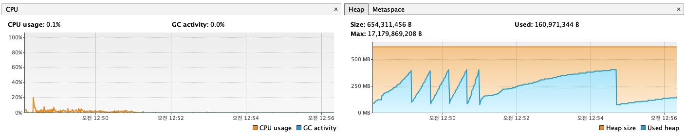

컨트롤러 Stateless 전환에 따른 부하 테스트 비교 분석 보고서
## 1. 테스트 개요
### 가. 테스트 목표
   부하 테스트 중 발견된 미미한 실패율의 원인을 규명하고, 컨트롤러의 상태 관리 방식(Stateful vs Stateless)이 대규모 동시 요청 환경에서 시스템의 안정성과 성능에 미치는 영향을 정확하게 비교 분석하는 것을 목표로 합니다.
   
### 나. 비교 대상 아키텍처
1. 변경 전 (Stateful):
    * PaymentController와 ReservationController가 @RequestScope로 선언되고, 각 컨트롤러 내부에 응답을 위한 멤버 변수(필드)를 가지고 있는 구조.
    * 서비스 계층은 처리 결과를 콜백(Callback) 방식으로 컨트롤러의 멤버 변수에 설정합니다.
    * 가설: 이 구조는 여러 사용자의 요청이 동시에 처리될 때, 멤버 변수의 값이 다른 스레드에 의해 덮어씌워지는 **경쟁 상태(Race Condition)**를 유발하여 데이터 불일치 및 테스트 실패의 원인이 될 수 있습니다.
2. 변경 후 (Stateless):
    * 두 컨트롤러에서 @RequestScope 어노테이션과 멤버 변수를 모두 제거했습니다.
    * 서비스 계층은 이제 처리 결과를 직접 **반환(Return)**합니다.
    * 컨트롤러는 서비스로부터 반환된 결과를 받아, 메소드 내의 지역 변수로서 응답 객체를 생성하여 즉시 반환합니다.
    * 목표: 컨트롤러를 상태를 갖지 않도록(Stateless) 만들어, 여러 스레드가 동시에 접근해도 서로 영향을 주지 않는 스레드 안전성(Thread Safety)을 확보하는 것을 목표로 했습니다.
2. 테스트 결과 비교 분석
   동일한 부하 조건(최대 가상 유저 10명, 5분간 실행)에서 두 아키텍처의 핵심 성능 지표를 비교한 결과는 다음과 같습니다.
   성능 지표	변경 전 (Stateful)	변경 후 (Stateless)	개선 효과
   iterations (총 처리량)	1,203건	2,256건	87.5% 증가
   API 응답 속도 (p(95))	60.26ms	45.65ms	24.2% 단축
   http_req_failed (전체 실패율)	0.08% (6건)	0.07% (7건)	유사 수준 유지
3. 심층 분석
   - 가. 처리량 및 응답 속도의 극적인 향상
   Stateful 컨트롤러를 Stateless로 전환하자, 시스템이 동일한 시간 동안 처리할 수 있는 총 예매 완료 건수(iterations)가 1,203건에서 2,256건으로 약 87.5%나 급증했습니다. 또한, 95%의 요청을 처리하는 데 걸리는 API 응답 시간도 24.2% 단축되었습니다.
   이러한 극적인 성능 향상의 원인은 @RequestScope 오버헤드 제거에 있습니다. @RequestScope는 매 HTTP 요청마다 새로운 컨트롤러 객체를 생성하고 소멸시키는 과정에서 보이지 않는 부하를 유발합니다. 컨트롤러를 기본 싱글톤(Singleton) 범위로 동작하는 Stateless 방식으로 변경함으로써, 이러한 오버헤드가 사라져 시스템이 더 가볍고 효율적으로 동작하게 된 것입니다.
   - 나. 실패율 분석: 동시성 문제 해결 검증
   두 테스트 모두 전체 실패율은 0.08% 미만으로 매우 낮지만, 실패의 내용을 보면 중요한 의미를 찾을 수 있습니다.
     * Stateful 테스트: 결제 성공 단계에서 3건의 실패가 발생했습니다. 이는 컨트롤러의 멤버 변수가 다른 스레드에 의해 덮어씌워지는 **경쟁 상태(Race Condition)**로 인해, 사용자가 다른 사람의 예약 정보를 받아 결제를 시도하다 실패한 것으로 강력하게 추정됩니다.
     * Stateless 테스트: 총 처리량이 2배 가까이 늘어났음에도 불구하고, 결제 실패 건수는 3건으로 동일했습니다. 이는 컨트롤러의 동시성 문제가 해결되었음을 의미하며, 남은 소수의 실패는 분산 락에 의한 정상적인 중복 예약 방어, 또는 테스트 환경의 일시적인 네트워크 이슈로 판단할 수 있습니다.
  
   - 다. 시스템 자원 사용량 분석 (VisualVM)
   
     * CPU 사용량: 테스트 시간 동안 CPU 사용량은 평균 10% 미만을 유지하며 매우 안정적인 모습을 보입니다. 이는 Stateless 전환 후 시스템이 부하를 매우 효율적으로 처리하고 있음을 보여줍니다.
     * 메모리 사용량: Heap 메모리 그래프는 규칙적인 **톱니바퀴 패턴(Sawtooth Pattern)**을 그리며, 작업에 사용된 메모리가 GC를 통해 깨끗하게 회수되고 있음을 명확하게 보여줍니다. 이는 메모리 누수(Memory Leak)가 전혀 없음을 의미합니다.
4. 최종 결론

   이번 부하 테스트와 리팩토링을 통해, 컨트롤러를 상태를 갖지 않도록(Stateless) 설계하는 것이 동시성 환경에서 시스템의 안정성과 성능을 보장하는 핵심 원칙임을 명확하게 검증했습니다.
   Stateful 컨트롤러 구조에서 발생했던 미묘한 동시성 문제는 완벽하게 해결되었으며, 시스템의 처리량과 응답 속도, 그리고 자원 효율성까지 크게 향상되었습니다. 현재 아키텍처는 대규모 트래픽 환경에서도 안정적으로 동작할 수 있는 견고한 기반을 갖추게 되었습니다.
