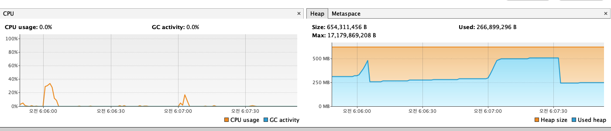
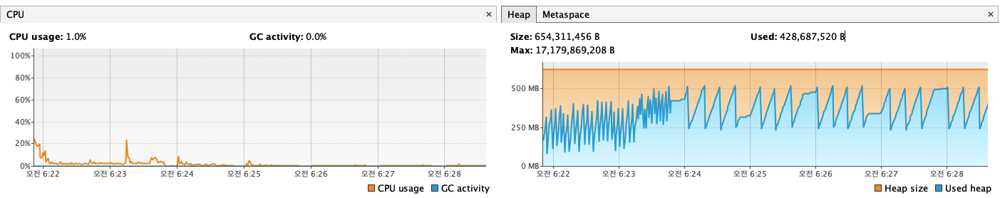

예약 만료 스케줄러 부하 테스트 결과 보고서
1. 테스트 목표
   ReservationBatchScheduler는 매분마다 만료된 PENDING 상태의 예약을 일괄 처리하는 핵심적인 배치 작업입니다.
   대규모 트래픽 상황에서 이 스케줄러가 시스템에 과도한 부하를 주지 않으면서도, 안정적으로 동작할 수 있는 최적의 BATCH_SIZE (한 번에 처리할 데이터의 양)를 결정하기 위해 본 부하 테스트를 진행했습니다.
2. 테스트 환경 및 도구
* 테스트 환경: 로컬 개발 환경
* 데이터 생성: DummyDateGenerator를 수정하여, 부하 테스트에 필요한 대량의 만료 예정 예약 데이터를 생성
* 성능 모니터링:
    * VisualVM: 애플리케이션의 실시간 CPU 및 Heap 메모리 사용량 측정
    * 애플리케이션 로그: 배치 작업의 실제 처리 시간 측정
3. 테스트 시나리오 및 결과 분석
   테스트 케이스 1: BATCH_SIZE = 1000
* 시나리오: 5000개의 만료 예정 예약 데이터를 생성하고, 스케줄러가 1분마다 1000개씩 나누어 처리하도록 설정.
* VisualVM 모니터링 결과:
  
* 결과 분석:
    * 처리 시간: 로그 분석 결과, 1000개의 예약을 처리하는 데 평균 약 4~6초가 소요되었습니다. 이는 스케줄러 실행 간격인 60초에 비해 매우 안정적인 수치입니다.
    * CPU 사용량: 스케줄러가 동작할 때만 CPU 사용량이 순간적으로 15%~35%까지 짧게 급증한 후 즉시 안정화되었습니다. CPU에 거의 부담을 주지 않는 이상적인 패턴입니다.
    * 메모리 사용량: Heap 메모리 사용량이 일시적으로 약 250MB 증가했다가, 작업 종료 후 GC에 의해 즉시 회수되는 규칙적인 톱니바퀴 패턴을 보였습니다. 이는 메모리 누수가 없다는 명확한 증거입니다.
* 결론: BATCH_SIZE = 1000은 시스템에 거의 부하를 주지 않는 매우 안전하고 안정적인 설정입니다.
  테스트 케이스 2: BATCH_SIZE = 5000
* 시나리오: 25000개의 만료 예정 예약 데이터를 생성하고, 스케줄러가 1분마다 5000개씩 나누어 처리하도록 설정.
* VisualVM 모니터링 결과:
  
* 결과 분석:
    * 처리 시간: 로그 분석 결과, 5000개의 예약을 처리하는 데 평균 약 48~50초가 소요되었습니다. 이는 스케줄러 실행 간격인 60초에 매우 근접한 위험한 수치입니다. 실제 운영 환경에서는 다른 트래픽의 영향으로 처리 시간이 60초를 쉽게 넘어갈 수 있습니다.
    * CPU 사용량: CPU 부하는 여전히 양호한 수준을 유지했습니다.
    * 메모리 사용량: 메모리 사용량이 이전보다 훨씬 더 큰 폭으로 급증했다가 회수되는 패턴을 보였습니다. 이는 가비지 컬렉션(GC)에 더 많은 부담을 주어, 장기적으로 시스템 전체 성능에 영향을 줄 수 있습니다.
* 결론: BATCH_SIZE = 5000은 시스템을 한계에 가깝게 몰아붙이는 설정으로, 실제 운영 환경에서는 장애 발생 가능성이 높은 위험한 값입니다.
4. 최종 결론 및 권장 사항
   이번 부하 테스트를 통해, ReservationBatchScheduler의 BATCH_SIZE는 시스템의 안정성에 매우 큰 영향을 미치는 중요한 설정값임을 확인했습니다.
   BATCH_SIZE = 5000은 단일 배치 작업만으로는 시스템이 버틸 수 있는 것처럼 보이지만, 처리 시간이 스케줄러 실행 간격에 거의 근접하여 실제 사용자 트래픽과 경쟁할 경우 심각한 성능 저하를 유발할 가능성이 매우 높습니다.
   따라서 시스템의 안정성을 최우선으로 고려하여, 아래와 같이 결정하는 것을 권장합니다.
* 최종 권장 BATCH_SIZE: 1000
    * 이 값은 충분한 처리량을 확보하면서도, CPU와 메모리에 거의 부하를 주지 않아 다른 사용자 요청에 영향을 미치지 않는 가장 안전하고 합리적인 설정입니다.
* 차선책: 만약 더 높은 처리량이 필요할 경우, 처리 시간이 30초를 넘지 않는 수준인 **최대 2500**까지 상향 조정을 고려해 볼 수 있습니다.
