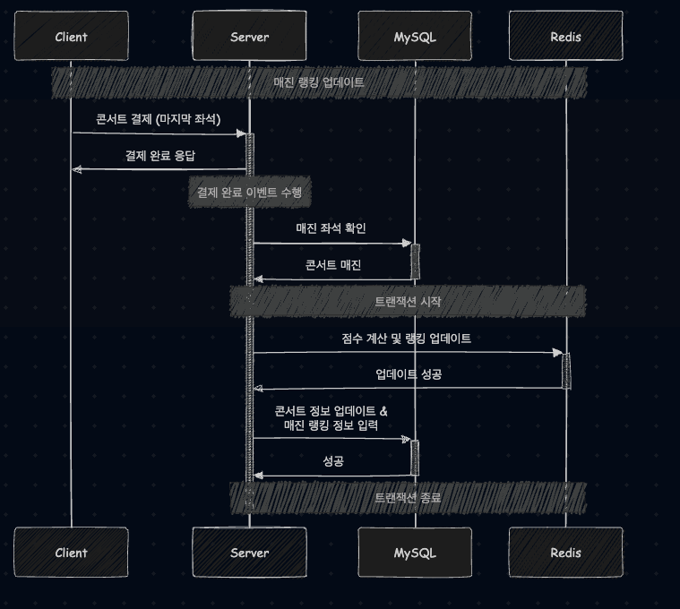

# 콘서트 매진 랭킹 설계 보고서

# 랭킹 산정 기준
## 좌석 상태
좌석이 임시로 배정된 상태(예약)는 매진으로 간주하기에 적절하지 않다고 판단됩니다. 
최종 결제가 완료되지 않으면 임시 배정은 만료됩니다.

따라서 정확한 좌석 상태를 기준으로 랭킹을 산정하는 것이 바람직하다고 생각합니다.

### 결론: **전체 좌석 상태가 배정('ASSIGNED')된 경우를 기준으로 산정**

## 점수 산정
- 티켓팅 오픈 시간부터 마지막 좌석 결제까지의 시간차이를 이용 (마지막 좌석 결제 시간 - 티켓팅 오픈시간) 
> **concert 테이블 open_time, sold_out_time 필드 추가**

### 동일 점수 처리 방안
티켓팅 오픈 시간부터 마지막 좌석 결제 시간의 차이가 동일하면 어떻게 처리할것인가
- 전체 좌석수가 많은 콘서트가 우선 순위
    - 현재 날짜별 좌석개수는 50개로 고정되어있음
    - 따라서 콘서트 날짜가 많을수록 우선 순위 부여

**그래도 동일하면?**
- 콘서트 티켓팅 오픈시간이 먼저인것을 우선순위로 결정

**정리**
1. (마지막 좌석 결제 시간 - 티켓팅 오픈시간) 짧은 순
2. 콘서트 개최 날짜가 많은 순
3. 오픈시간이 먼저

> 이 정도만 고려해도 동일 점수에 대한 대안이 충분하다고 생각됩니다. 
> 그래도 동일하면 Sorted Set의 정렬 규칙에 따라 자동으로 처리됩니다.

### 추가 고려사항
#### 콘서트의 명칭이 중복된다면?
> 예) 2023 싸이 흠뻑쇼, 2024 싸이 흠뻑쇼 등

갱신할 것인지 개별 콘서트로 랭킹 산정할 것인지  
**결론: 고유한 concertId별로 랭킹 산정(개별로 본다)**

## 구현 방식
> Redis Sorted Set 자료구조를 사용하여 구현  
> ```ZADD soldOutRank {점수} {ConcertId} ```

### 점수 계산 방식
```
점수 = 매진시간(초) + (100 - 콘서트 날짜 수) + 오픈시간 타임스탬프(초)
문자열 형식으로 이어붙이고 long 타입으로 변환
예) 
- A콘서트: 300초만에 매진, 5일 개최, 2025-01-01 오픈
- B콘서트: 300초만에 매진, 3일 개최, 2025-01-01 오픈

A콘서트 점수: 300,951,735,689,600
B콘서트 점수: 300,971,735,689,600

A콘서트 점수가 낮음
1. A콘서트
2. B콘서트

점수가 낮을수록 랭킹이 높음
```
#### 고려할 점
long 타입 범위 초과 가능성 있지만 가능성 낮음  
long 타입 최대범위: 9,223,372,036,854,775,807

매진 시간이 4달 걸린 경우: 10,368,000초  
예시 - 4달만에 매진, 5일 개최, 2025-01-01 오픈   
점수: 10,368,000,971,735,689,600 -> long 타입 범위 초과

하지만 발생 가능성 아주 낮음 - 고려 X

### 랭킹 갱신 방식
1. 좌석 결제 시 이벤트 발행 -> 비동기 처리
    - 실시간성 좋음
2. 스케줄러 사용
    - 매일 or 시간별 스케줄러 동작
    - 실시간성 부족함

**좌석 결제 시 이벤트 발행** 방식으로 결정

### 랭킹 데이터 집계 방식
랭킹 데이터를 어디까지 집계할지
1. 상위 랭킹만 관리
2. 전체 콘서트

전체 콘서트 랭킹을 관리하지만   
Redis에선 상위 100위까지 랭킹 데이터 관리  
DB에서 전체 콘서트 랭킹 정보 관리(백업용도로도 사용 가능)

> Redis 자체 최대 저장 개수를 지정하는 옵션 부재  
> ZREMRANGEBYRANK key 100 -1 명령어를 통해 랭킹 저장 후 100개까지 잘라줘야함  
> 저장 -> 100위까지 자르기 (Lua 스크립트 활용해 원자적으로 수행)

#### 고려할 점
Redis와 DB의 정합성은 어떻게 관리할 것인지
1. Redis 랭킹 업데이트시 DB 함께 Insert
2. 스케줄러 사용하여 일정 시간마다 동기화

~~DB와의 정합성이 실시간으로 보장되지않아도 상관없다고 생각됨~~  
~~성능적으로도 스케줄러를 사용해 일정 시간마다 동기화 하는것이 나을것이라 판단~~

~~**스케줄러 사용한 동기화 방식 사용**~~
**Redis 랭킹 업데이트시 DB에 함께 Insert**

## 매진 랭킹 테이블
```sql
CREATE TABLE `SOLD_OUT_RANK` (
    `id` VARCHAR(36) NOT NULL COMMENT '매진 랭킹 UUID',
    `concert_id` VARCHAR(36) NOT NULL COMMENT '콘서트 UUID',
    `score` BIGINT NOT NULL COMMENT '랭킹 점수 (매진시간+콘서트날짜수+오픈시간)',
    `sold_out_time` BIGINT NOT NULL COMMENT '매진 소요 시간(초)',
    `created_at` TIMESTAMP NOT NULL DEFAULT CURRENT_TIMESTAMP COMMENT '생성일시',
    `updated_at` TIMESTAMP NOT NULL DEFAULT CURRENT_TIMESTAMP ON UPDATE CURRENT_TIMESTAMP COMMENT '수정일시',
    PRIMARY KEY (`id`),
    UNIQUE KEY `uk_concert_id` (`concert_id`),
    FOREIGN KEY (`concert_id`) REFERENCES `CONCERT`(`id`) ON DELETE CASCADE ON UPDATE CASCADE
);
```
- 순위 컬럼을 별도로 두지 않고, 점수 기반 정렬로 순위를 판단
- 순위 컬럼을 포함하면 랭킹 업데이트 시 오버헤드가 발생할 수 있기에 점수 기반으로 정렬하여 순위를 판단

## 매진 랭킹 업데이트 플로우


## 매진 랭킹 조회 플로우


## 정리
- 랭킹 산정 기준: 전체 좌석 상태 배정('ASSIGNED')기준
- 점수 산정:
    1. 매진시간 짧은 순
    2. 콘서트 날짜 많은 순
    3. 티켓팅 오픈 시간 먼저 인 순
    - 문자열 형식으로 이어붙힌 후 long 타입 변환 (long 범위 초과 고려 안함)
- 랭킹 갱신 방식: 좌석 결제 시 이벤트 발행 -> 매진 체크 -> 랭킹 업데이트
- 랭킹 집계 방식:
    - 상위 100위까지 Redis에서 관리
    - 전체 콘서트 랭킹 DB에서 관리
    - Redis 랭킹 업데이트시 DB에도 같이 Insert
- 추가 사항
    - Concert 테이블 오픈 시간, 매진 시간 필드 추가 및 검증
    - DB 매진 랭킹 테이블 추가

